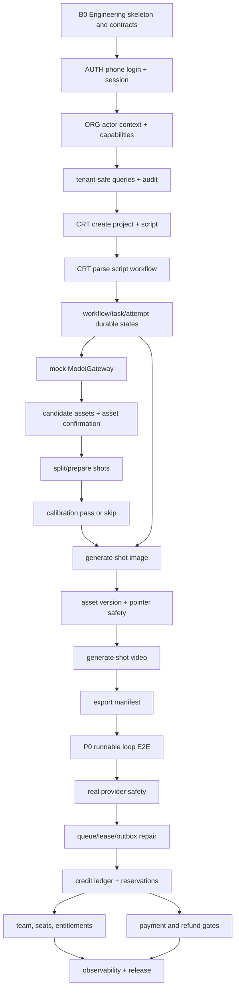

# P0 Capability Delivery Execution System

> Status: v1 delivery operating system  
> Date: 2026-05-21  
> Scope: ReelMate-style AI comic drama creator loop  
> Inputs: `docs/product/reelmate-core-replication-prd.md`, `docs/architecture/p0-module-implementation-blueprint.md`, `docs/architecture/p0-delivery-execution-system.md`, current backend modules under `apps/backend/src/modules`, current contracts under `packages/contracts`.

This document turns the module blueprint into an execution system that a team can run daily and validate weekly.

It is not a code-layer task list. It is organized around delivered capabilities, dependency order, verification gates, risk exposure, and release readiness.

## 0. Operating Rule

Every task must answer five questions before it can enter development:

```text
What user or operator capability does this deliver?
What does it depend on?
What data and states does it change?
How can we prove it works?
What risk does it burn down for the minimum runnable loop?
```

A task is not done because code exists. It is done only when the behavior is testable, observable, and accepted against the task card.

## 1. Deliverable 1: Minimum Runnable Loop

### 1.1 First Closed Loop

The first milestone is a true vertical creator loop:

```text
Phone-code login
  -> resolve organization, workspace, membership, and capabilities
  -> create project with script text
  -> request script parse workflow
  -> persist workflow, task, attempt, provider request, and status
  -> query status after page refresh
  -> create parsed episodes, assets, and shots from mock provider output
  -> confirm key character and scene assets
  -> split or prepare shots
  -> pass or explicitly skip calibration with audit
  -> generate one shot image with mock ModelGateway
  -> create immutable asset version and move shot current pointer safely
  -> generate one shot video with mock ModelGateway
  -> create export package manifest
  -> query final project readiness and export status
```

### 1.2 Realness Requirements

This loop is accepted only if it uses:

- Real HTTP/API entrypoints or command runtime calls, not frontend-only state.
- Real migration-backed persistence through the active database test harness.
- Real session guard and backend capability checks.
- Real idempotency records for project creation, script parsing, shot generation, video generation, and export creation.
- Real workflow/task/attempt/provider request state transitions.
- Real mock provider behind the `ModelGateway` adapter boundary.
- Real immutable asset versions. Regeneration must never overwrite prior output.
- Real status query after refresh. Redis or in-memory queue state cannot be the only truth.
- Real structured logs carrying at least `traceId`, `organizationId`, `workspaceId`, `projectId`, and task/workflow IDs where applicable.
- Real tests in the repository test runner: `npm test -- <target>`.

### 1.3 Non-Goals For The First Loop

The first loop deliberately excludes:

- Real paid provider calls.
- Real payment, refund, invoice, or coupon flows.
- Full team member administration.
- Full asset marketplace or team asset library.
- Pixel-level ReelMate UI replication.

Those are not ignored. They are staged after the loop proves auth, tenant scope, persistence, workflow state, idempotency, mock generation, asset versioning, export, and observability.

## 2. Deliverable 2: Capability Breakdown

### 2.1 Capability Groups

| Epic | Capability ID | Capability | Owner | Business Value | Technical Risk | First Verification |
| --- | --- | --- | --- | --- | --- | --- |
| Foundation | FND-01 | Migration-backed database harness | Platform/DB | High | High | Schema tests and persistence tests run locally |
| Foundation | FND-02 | Contract registry and operation names | Contracts | High | High | `packages/contracts/api/contracts.spec.ts` |
| Foundation | FND-03 | Persistent idempotency helper | Shared | High | High | replay, conflict, concurrent first request |
| Foundation | FND-04 | Unified error response and error codes | API/Shared | High | Medium | API negative tests assert stable codes |
| Foundation | FND-05 | Trace/log context propagation | API/Ops | Medium | High | logs contain required IDs on failure |
| Foundation | FND-06 | Audit append helper | Audit | Medium | Medium | sensitive commands write audit events |
| Identity | AUTH-01 | Phone-code issue and verify | Identity | High | High | valid, expired, wrong, consumed, disabled user |
| Identity | AUTH-02 | Server-side session guard | Identity | High | High | unauthenticated requests fail before domain write |
| Organization | ORG-01 | Actor context resolver | Organization | High | High | user/org/workspace/membership resolution |
| Organization | ORG-02 | Capability assertions | Organization | High | High | 403 tests for missing capability |
| Organization | ORG-03 | Tenant-safe query helper | Shared/DB | High | High | cross-tenant negative tests |
| Creator | CRT-01 | Create project with script input | Project | High | High | `CreateProject` replay and conflict |
| Creator | CRT-02 | Parse script workflow | Project, Workflow, ModelGateway | High | High | status survives refresh, duplicate parse returns same workflow |
| Creator | CRT-03 | Extract candidate assets | Project/Asset | High | Medium | candidate role, scene, prop rows created |
| Creator | CRT-04 | Confirm and edit key assets | Asset Review | High | Medium | key role/scene gate can pass and fail |
| Creator | CRT-05 | Split or prepare shots | Project/Shot | High | High | shots created with stable order and statuses |
| Creator | CRT-06 | Calibration pass/skip gate | Calibration/Audit | High | Medium | backend blocks batch generation until gate exists |
| Creator | CRT-07 | Generate one shot image | Shot, Workflow, ModelGateway, Asset | High | High | mock provider result creates asset version |
| Creator | CRT-08 | Generate one shot video | Shot, Workflow, ModelGateway, Asset | High | High | requires current image; creates video version |
| Creator | CRT-09 | Export package manifest | Export | High | Medium | missing assets explicit; manifest ready |
| Asset Library | AST-01 | Personal/project asset query | Asset | Medium | Medium | filter by project/type/source/status |
| Asset Library | AST-02 | Team asset entitlement gate | Asset/Organization | Medium | Medium | professional/team permission enforced by backend |
| Team | TEAM-01 | Member role and permission model | Organization | Medium | High | role matrix maps to capabilities |
| Team | TEAM-02 | Seat/plan gate for member creation | Organization/Billing | Medium | Medium | create member blocked when seat unavailable |
| Credit | CRD-01 | Credit balance read model | Credit | High | High | ledger recomputation matches cached balance |
| Credit | CRD-02 | Generation reservation and settlement | Credit, Workflow | High | High | no oversell, single consume/release |
| Provider | PRV-01 | Provider request persisted before external call | ModelGateway | High | High | crash-after-submit yields `result_unknown` |
| Provider | PRV-02 | No blind retry after external submission | ModelGateway, Workflow | High | High | recovery does not double submit |
| Ops | OPS-01 | Stuck workflow repair | Workflow/Ops | High | High | queued loss and lease expiry repaired |
| Ops | OPS-02 | Manual review and settlement | Admin/Ops | High | High | unresolved provider/credit states visible |
| Release | REL-01 | CI gates and staging dry run | Infra/Ops | High | Medium | contracts, unit, integration, P0 E2E |
| Release | REL-02 | Metrics, dashboards, alerts, runbooks | Ops | High | High | incident drill can locate task/payment/provider issue |

### 2.2 Capability Contract For Every Task

Every capability task must specify:

```text
Input:
Output:
Data read:
Data written:
State transition:
Command contract:
Event contract:
Permission:
Idempotency:
Failure behavior:
Logs/metrics:
Tests:
Acceptance:
```

If a task cannot fill those fields, it is not ready for development.

## 3. Deliverable 3: Dependency Graph



Critical path:

```text
B0 -> Auth -> Organization -> Tenant scope -> Project -> Workflow -> Mock provider -> Asset/Shot -> Calibration -> Image -> Video -> Export -> Provider safety -> Repair -> Credit -> Release
```

Work outside this path is allowed only if it does not starve the path or if it burns down a high-risk dependency.

## 4. Deliverable 4: Development Batches

| Batch | Target | Main Output | Exit Gate |
| --- | --- | --- | --- |
| B0 | Engineering skeleton | contracts, migration harness, test runner, error/log baseline | `npm test -- packages/contracts` and schema smoke tests pass |
| B1 | Tenant-safe platform | login, session, actor context, capabilities, audit | protected command denies 401/403 correctly and tenant leak tests pass |
| B2 | Project and workflow spine | create project, script parse workflow, durable status | create -> parse -> status query survives refresh |
| B3 | Asset and storyboard closure | candidate assets, confirmation, shot split, calibration | backend gate blocks generation until assets/calibration are valid |
| B4 | Image/video generation loop | one mock image and one mock video produce immutable versions | duplicate generation has no duplicate task/output; stale output cannot move pointer |
| B5 | Export and P0 demo | manifest export and full loop E2E | login -> project -> parse -> confirm -> shot -> image -> video -> export passes |
| B6 | External provider safety | provider request persistence, unknown handling, no blind retry | crash/timeout matrix passes before real provider dogfood |
| B7 | Reliability and repair | queue repair, lease repair, outbox replay, manual review | stuck task and result-unknown drills are recoverable |
| B8 | Credit and entitlement | credit ledger, reservation, settlement, team/seat gates | no oversell, single settlement, entitlement tests pass |
| B9 | Commerce and launch hardening | payment, refund, invoice, dashboards, alerts, release dry run | duplicate callback one grant; rollback and observability drill pass |

### Weekly Milestone Rhythm

| Week | Milestone | Weekly Demo | Must Not Slip Past The Week |
| --- | --- | --- | --- |
| W1 | B0/B1 | login and protected command denial | tenant scope and capability checks |
| W2 | B2 | create project and parse status after refresh | idempotency for project and parse |
| W3 | B3/B4 | generate one image from parsed shot | asset version and pointer safety |
| W4 | B5 | full P0 mock loop export | E2E test and demo script |
| W5 | B6/B7 | provider crash and repair drills | no blind retry after external start |
| W6 | B8 | credit reservation and entitlement gates | no oversell and single settlement |
| W7 | B9 | staging release dry run | dashboard, alert, rollback runbook |

## 5. Deliverable 5: Task Card List

Use this exact card format in GitHub, Linear, or local markdown issues.

```text
Task name:
Epic:
Capability:
Batch:
Business value:
Technical risk:
Owner:
Reviewers:
Prerequisites:
Input:
Output:
Data read:
Data written:
Command contract:
Event contract:
State transition:
Exception scenarios:
Idempotency:
Security:
Observability:
Tests:
Acceptance criteria:
Definition of Done:
Blocks:
Blocked by:
```

### B0-T01: Lock Contract And Test Runner Baseline

| Field | Content |
| --- | --- |
| Epic | Foundation |
| Capability | FND-02 |
| Batch | B0 |
| Business value / Technical risk | High / High |
| Owner | Platform |
| Prerequisites | Existing contracts under `packages/contracts` |
| Input | `packages/contracts/api/*.ts`, `packages/contracts/domain/*.ts`, `packages/contracts/events/*.ts` |
| Output | executable contract baseline |
| Data read/write | None |
| Command contract | all P0 API command contracts |
| Event contract | all P0 event contracts |
| Exception scenarios | missing operation name, missing verification ID, expensive command not idempotent |
| Idempotency | contract metadata must mark expensive commands idempotent |
| Security | capability required on every command |
| Observability | test output identifies drift by command name |
| Tests | `npm test -- packages/contracts` |
| Acceptance criteria | every operation name has one command contract; every command has capability, state preconditions, business errors, verification IDs |
| Definition of Done | tests pass, drift rule documented, PR links contract gate |
| Blocks | all API implementation tasks |

### B1-T01: Phone-Code Login Issue And Verify

| Field | Content |
| --- | --- |
| Epic | Identity |
| Capability | AUTH-01 |
| Batch | B1 |
| Business value / Technical risk | High / High |
| Owner | Identity |
| Prerequisites | `login_challenges`, `auth_sessions`, users migration |
| Input | phone number, purpose, verification code |
| Output | server-controlled active session |
| Data read | `users`, `login_challenges` |
| Data written | `login_challenges`, `auth_sessions`, `users.last_login_at` |
| Command contract | auth command shape to be added if exposed through public API |
| Event contract | optional `auth.login_succeeded` audit event |
| State transition | `login_challenges.issued -> consumed`; `auth_sessions.active` |
| Exception scenarios | invalid phone, wrong code, expired code, consumed code, disabled user, rate limit |
| Idempotency | issue throttled by phone/IP; verify consumes one challenge once |
| Security | hash code and session token; mask phone in logs |
| Observability | `traceId`, masked phone, challenge result, rate limit bucket |
| Tests | login issue, verify success, expired, wrong, consumed, disabled user |
| Acceptance criteria | one code cannot create multiple sessions; plaintext code/token is never persisted |
| Definition of Done | service, handler, persistence test, API test, errors, logs |
| Blocks | actor context and all protected commands |

### B1-T02: Actor Context And Capability Resolver

| Field | Content |
| --- | --- |
| Epic | Organization |
| Capability | ORG-01, ORG-02, ORG-03 |
| Batch | B1 |
| Business value / Technical risk | High / High |
| Owner | Organization |
| Prerequisites | active session |
| Input | session token, organization/workspace scope |
| Output | `ActorContext` with user, organization, workspace, membership, capabilities |
| Data read | `users`, `organizations`, `workspaces`, `memberships` |
| Data written | none, except audit on denied sensitive actions if required |
| Command contract | all protected commands consume `capability` metadata |
| Event contract | none |
| State transition | none |
| Exception scenarios | no session, disabled user, suspended org, archived workspace, missing membership, missing capability |
| Idempotency | read-only |
| Security | every backend command calls `assertCapability`; UI hiding is not security |
| Observability | `traceId`, `userId`, `organizationId`, denial reason |
| Tests | 401, 403, disabled user/org/member, tenant leak negative tests |
| Acceptance criteria | unauthorized requests never reach domain write path |
| Definition of Done | resolver, guard, fixtures, negative tests, logs |
| Blocks | project, generation, export, team, billing commands |

### B2-T01: Create Project With Script Input

| Field | Content |
| --- | --- |
| Epic | Creator |
| Capability | CRT-01 |
| Batch | B2 |
| Business value / Technical risk | High / High |
| Owner | Project |
| Prerequisites | B1-T02, persistent idempotency |
| Input | workspace ID, project name, script text or uploaded asset, aspect ratio, resolution |
| Output | project ID, script ID, initial project phase |
| Data read | workspace and membership scope |
| Data written | `projects`, `scripts`, `idempotency_records`, `audit_events` |
| Command contract | `CreateProject` in `packages/contracts/api/project.commands.ts` |
| Event contract | optional `project.created` |
| State transition | none -> `project.project_phase = script_input`; `script.status = ready` |
| Exception scenarios | invalid input, missing workspace, forbidden, duplicate key conflict |
| Idempotency | `(organization_id, project.create, idempotency_key)` with request hash |
| Security | `project:create`; tenant-scoped workspace |
| Observability | `traceId`, `organizationId`, `workspaceId`, `projectId`, actor |
| Tests | success, invalid input, replay, conflict, forbidden, tenant mismatch |
| Acceptance criteria | replay returns same project; conflicting replay returns stable 409; project and script are persisted together |
| Definition of Done | command, repository/store, tests, error docs, audit/logs |
| Blocks | script parse workflow |

### B2-T02: Parse Script Workflow With Mock Provider

| Field | Content |
| --- | --- |
| Epic | Creator |
| Capability | CRT-02, FND-03 |
| Batch | B2 |
| Business value / Technical risk | High / High |
| Owner | Project, Workflow, ModelGateway |
| Prerequisites | B2-T01, workflow/task tables, mock provider adapter |
| Input | project ID, script ID |
| Output | workflow ID, task ID, durable parse status |
| Data read | `projects`, `scripts`, active workflow/idempotency records |
| Data written | `workflows`, `tasks`, `task_attempts`, `provider_requests`, `episodes`, candidate `assets`, `shots` |
| Command contract | `ParseScript` |
| Event contract | `task.succeeded`, `workflow.completed` |
| State transition | `script.ready -> parsing -> parsed/failed`; workflow `queued -> running -> succeeded/failed` |
| Exception scenarios | duplicate parse, script not ready, provider mock failure, worker crash before finalization |
| Idempotency | `script.parse` duplicate running request returns same workflow |
| Security | `project:edit` |
| Observability | `workflowId`, `taskId`, `attemptId`, parse stage, provider request ID |
| Tests | success, duplicate running parse, failed parse, status survives refresh, rollback on finalization failure |
| Acceptance criteria | page refresh never creates duplicate workflow; PostgreSQL status is authoritative |
| Definition of Done | command, worker path, mock provider, tests, logs |
| Blocks | asset confirmation and shot split |

### B3-T01: Asset Extraction And Confirmation Gate

| Field | Content |
| --- | --- |
| Epic | Creator |
| Capability | CRT-03, CRT-04 |
| Batch | B3 |
| Business value / Technical risk | High / Medium |
| Owner | Asset Review |
| Prerequisites | parsed script output with candidate assets |
| Input | candidate character, scene, prop assets; user edits and confirmation |
| Output | confirmed key assets and review state |
| Data read | `assets`, parsed episodes/shots |
| Data written | `assets.status`, `assets.description`, `assets.is_key_asset`, `audit_events` |
| Command contract | asset review commands, or extend project command contracts |
| Event contract | `asset.confirmed` if event consumers need it |
| State transition | asset `pending -> confirmed/needs_fix`; project readiness `assets_pending -> assets_reviewing` |
| Exception scenarios | missing key role, missing main scene, invalid asset edit, unauthorized confirmation |
| Idempotency | confirmation command replay is a no-op if request hash matches |
| Security | `project:edit` |
| Observability | `assetId`, asset type, key flag, actor |
| Tests | confirm role, edit description, block missing key asset, forbidden, audit |
| Acceptance criteria | backend blocks shot generation when required key assets are not confirmed |
| Definition of Done | API/command, service, tests, audit/logs |
| Blocks | shot preparation and calibration |

### B3-T02: Split Or Prepare Shots

| Field | Content |
| --- | --- |
| Epic | Creator |
| Capability | CRT-05 |
| Batch | B3 |
| Business value / Technical risk | High / High |
| Owner | Project/Shot |
| Prerequisites | parsed script and asset review gate |
| Input | project ID, script ID, episode structure |
| Output | ordered shots with content status and generation readiness |
| Data read | `episodes`, confirmed assets |
| Data written | `shots`, `shot_asset_links`, workflow/task rows if async |
| Command contract | `SplitShots` |
| Event contract | `shots.split_completed` if async |
| State transition | project readiness `assets_reviewing -> shots_ready`; shot `draft -> ready` |
| Exception scenarios | no parsed script, incomplete key assets, duplicate split, partial failure |
| Idempotency | `shots.split` returns existing workflow or current shot set |
| Security | `project:edit` |
| Observability | `projectId`, `episodeId`, shot count, failure count |
| Tests | success, duplicate split, missing assets blocks, stable ordering |
| Acceptance criteria | repeated split cannot create duplicate shot rows for the same script revision |
| Definition of Done | command, store, tests, logs |
| Blocks | calibration and generation |

### B3-T03: Calibration Pass Or Skip Gate

| Field | Content |
| --- | --- |
| Epic | Creator |
| Capability | CRT-06 |
| Batch | B3 |
| Business value / Technical risk | High / Medium |
| Owner | Calibration/Audit |
| Prerequisites | ready shots |
| Input | three representative shot IDs or explicit skip reason |
| Output | durable calibration session and decision |
| Data read | `shots`, current asset references |
| Data written | `calibration_sessions`, `calibration_items`, `calibration_decisions`, `audit_events` |
| Command contract | calibration commands in `packages/contracts/api/calibration.commands.ts` |
| Event contract | `calibration.passed` |
| State transition | `draft/generating/ready_for_review -> passed/skipped/failed` |
| Exception scenarios | fewer than three shots, invalid shot scope, failed calibration, unauthorized skip |
| Idempotency | operation names for generate/pass/skip |
| Security | `project:edit`; skip requires elevated role if policy demands |
| Observability | `calibrationSessionId`, selected shot IDs, decision, actor |
| Tests | pass, skip, invalid count, forbidden, generation blocked before pass/skip |
| Acceptance criteria | `GenerateShotImage` fails with `calibration_required` until durable gate exists |
| Definition of Done | service, command, tests, audit/logs |
| Blocks | batch image generation |

### B4-T01: Generate Shot Image With Mock Provider

| Field | Content |
| --- | --- |
| Epic | Creator |
| Capability | CRT-07 |
| Batch | B4 |
| Business value / Technical risk | High / High |
| Owner | Shot, Workflow, ModelGateway, Asset |
| Prerequisites | ready shot, calibration passed/skipped, provider mock |
| Input | shot ID, prompt override, idempotency key |
| Output | workflow ID, task ID, completed image asset version |
| Data read | `shots`, calibration state, asset context, credit availability placeholder |
| Data written | `workflows`, `tasks`, `task_attempts`, `provider_requests`, `assets`, `asset_versions`, `shots.current_image_asset_version_id` |
| Command contract | `GenerateShotImage` |
| Event contract | `task.succeeded`, `asset.version.created` |
| State transition | shot image `ready/failed/stale -> generating -> completed/failed` |
| Exception scenarios | calibration missing, shot not ready, duplicate running generation, provider failure, stale completion |
| Idempotency | `shot.image.generate` plus active task/content revision guard |
| Security | `generation:start` |
| Observability | `workflowId`, `taskId`, `attemptId`, `providerRequestId`, `shotId`, version ID |
| Tests | success, duplicate running, provider failure, stale completion cannot move pointer, replay |
| Acceptance criteria | regeneration creates a new version and never overwrites old output |
| Definition of Done | command, mock provider, finalization, tests, logs |
| Blocks | shot video generation and export |

### B4-T02: Generate Shot Video With Mock Provider

| Field | Content |
| --- | --- |
| Epic | Creator |
| Capability | CRT-08 |
| Batch | B4 |
| Business value / Technical risk | High / High |
| Owner | Shot, Workflow, ModelGateway, Asset |
| Prerequisites | completed current shot image |
| Input | shot ID, motion prompt, model options, idempotency key |
| Output | workflow ID, task ID, completed video asset version |
| Data read | `shots.current_image_asset_version_id`, image asset metadata |
| Data written | `workflows`, `tasks`, `task_attempts`, `provider_requests`, `asset_versions`, `shots.current_video_asset_version_id` |
| Command contract | `GenerateShotVideo` |
| Event contract | `task.succeeded`, `asset.version.created` |
| State transition | shot video `ready/failed/stale -> generating -> completed/failed` |
| Exception scenarios | no current image, duplicate running generation, provider failure, stale image version |
| Idempotency | `shot.video.generate` plus source image version guard |
| Security | `generation:start` |
| Observability | `workflowId`, `taskId`, `shotId`, source image version, video version |
| Tests | success, missing image blocks, replay, stale source blocks pointer move |
| Acceptance criteria | video generation cannot start without a durable current image version |
| Definition of Done | command, service, tests, logs |
| Blocks | export completeness and P0 demo |

### B5-T01: Export Package Manifest

| Field | Content |
| --- | --- |
| Epic | Creator |
| Capability | CRT-09 |
| Batch | B5 |
| Business value / Technical risk | High / Medium |
| Owner | Export |
| Prerequisites | at least one completed image or video asset |
| Input | project ID, export scope, allow incomplete flag |
| Output | export record and manifest |
| Data read | `projects`, `episodes`, `shots`, `assets`, `asset_versions` |
| Data written | `exports`, manifest metadata, audit event |
| Command contract | `CreateExport` |
| Event contract | `export.ready` |
| State transition | export `preparing -> ready/failed` |
| Exception scenarios | missing assets, no exportable shots, duplicate request, forbidden |
| Idempotency | `export.create` operation name |
| Security | `export:create` |
| Observability | `exportId`, manifest item count, missing count |
| Tests | success, missing assets explicit, no silent failure, replay |
| Acceptance criteria | export can be demonstrated as the final result of the minimum loop |
| Definition of Done | command, manifest service, tests, logs |
| Blocks | P0 runnable loop acceptance |

### B5-T02: P0 Runnable Loop E2E

| Field | Content |
| --- | --- |
| Epic | Release |
| Capability | REL-01 |
| Batch | B5 |
| Business value / Technical risk | High / High |
| Owner | QA/Platform |
| Prerequisites | B1 through B5 task exit gates |
| Input | scripted test fixture with phone user, workspace, script text |
| Output | repeatable E2E test and demo script |
| Data read/write | entire P0 loop data set |
| Command contract | all P0 loop commands |
| Event contract | workflow/task/export events |
| State transition | full project lifecycle through export ready |
| Exception scenarios | one injected provider failure, one duplicate replay, one refresh during running task |
| Idempotency | E2E repeats must not create duplicate expensive work from same idempotency keys |
| Security | test includes one forbidden tenant access attempt |
| Observability | one trace ID follows the demo path |
| Tests | `npm test -- p0-loop` or equivalent target once added |
| Acceptance criteria | the team can demo the loop every week from a clean fixture |
| Definition of Done | E2E committed, docs updated, demo path documented |
| Blocks | real provider dogfood |

### B6-T01: Provider Side-Effect Protection

| Field | Content |
| --- | --- |
| Epic | Provider |
| Capability | PRV-01, PRV-02 |
| Batch | B6 |
| Business value / Technical risk | High / High |
| Owner | ModelGateway |
| Prerequisites | mock generation loop |
| Input | provider payload, task/attempt context |
| Output | provider request persisted before external call and explicit unknown handling |
| Data read | task/attempt/provider config |
| Data written | `provider_requests`, task/attempt status |
| Command contract | internal provider submit contract |
| Event contract | provider result event if async callback exists |
| State transition | provider request `created/submitted/accepted -> succeeded/failed/result_unknown` |
| Exception scenarios | crash before submit, crash after submit, timeout before accepted, timeout after accepted |
| Idempotency | provider client request ID; no blind retry after `external_submission_started_at` |
| Security | provider secrets never logged; payload redacted where needed |
| Observability | `providerRequestId`, provider, model, capability, retry decision |
| Tests | crash-before, crash-after, no-blind-retry, upsert concurrency |
| Acceptance criteria | recovery after external submission never creates a second provider request automatically |
| Definition of Done | adapter policy, tests, logs, runbook note |
| Blocks | real provider dogfood |

### B7-T01: Workflow Repair And Manual Review

| Field | Content |
| --- | --- |
| Epic | Ops |
| Capability | OPS-01, OPS-02 |
| Batch | B7 |
| Business value / Technical risk | High / High |
| Owner | Workflow/Ops |
| Prerequisites | durable workflow/task/attempt states and provider unknown handling |
| Input | stuck queued/running/result_unknown workflow |
| Output | repaired task, manual review record, or safe no-op |
| Data read | workflows, tasks, attempts, provider requests, outbox |
| Data written | task/workflow status, repair audit, outbox retry metadata |
| Command contract | Admin/Ops repair commands |
| Event contract | repair/retry events |
| State transition | stuck states -> queued/running/manual_review_required/succeeded/failed |
| Exception scenarios | Redis loss, worker lease expiry, double claim, finalization rollback, outbox replay |
| Idempotency | repeated repair job produces same final outcome or no-op |
| Security | `ops:settle`; all manual actions audited |
| Observability | stuck duration, repair reason, operator/system actor |
| Tests | redis loss, lease repair, task claim concurrency, manual review aggregation |
| Acceptance criteria | no stuck state is invisible; repair never bypasses domain ownership |
| Definition of Done | repair service, admin command, tests, runbook |
| Blocks | release readiness |

### B8-T01: Credit Reservation And Settlement

| Field | Content |
| --- | --- |
| Epic | Credit |
| Capability | CRD-01, CRD-02 |
| Batch | B8 |
| Business value / Technical risk | High / High |
| Owner | Credit/Billing |
| Prerequisites | generation workflow and task allocation model |
| Input | generation estimate, organization balance, task allocation |
| Output | reserved credits, single consume/release settlement, updated balance |
| Data read | credit ledger, reservations, tasks |
| Data written | `credit_ledger_entries`, `credit_reservations`, allocation rows, balance read model |
| Command contract | generation commands call credit reserve before task creation |
| Event contract | task succeeded/failed settlement events |
| State transition | reservation `active -> settled/released/manual_review_required` |
| Exception scenarios | insufficient credits, concurrent generation, duplicate finalization, unknown provider result |
| Idempotency | unique settlement per task allocation |
| Security | tenant-scoped balance and ledger reads |
| Observability | reservation ID, allocation ID, before/after balance, settlement type |
| Tests | no oversell, single settlement, duplicate finalization, ledger recomputation |
| Acceptance criteria | concurrent generation cannot oversell and duplicate finalization cannot double charge |
| Definition of Done | service, schema constraints, tests, reconciliation runbook |
| Blocks | paid beta and commercial launch |

### B8-T02: Team Seat And Entitlement Gates

| Field | Content |
| --- | --- |
| Epic | Team |
| Capability | TEAM-01, TEAM-02, AST-02 |
| Batch | B8 |
| Business value / Technical risk | Medium / High |
| Owner | Organization/Billing |
| Prerequisites | capability resolver, credit/plan read model |
| Input | create member request, role, workspace/project assignment |
| Output | member created or blocked with entitlement reason |
| Data read | organizations, memberships, plan/seat entitlement, team asset entitlement |
| Data written | memberships, audit event, optional invite record |
| Command contract | team member command to be added |
| Event contract | `member.created` if needed |
| State transition | none -> membership active/invited, or blocked |
| Exception scenarios | no available seat, insufficient plan, duplicate member, invalid role, forbidden |
| Idempotency | create member key by organization/user or invited identity |
| Security | owner/admin capability; role cannot grant more than actor owns |
| Observability | `organizationId`, actor, target user, role, blocked reason |
| Tests | seat available, no seat, role forbidden, duplicate, team asset library gate |
| Acceptance criteria | backend enforces the same gates seen in ReelMate screenshots: member creation and team assets require entitlement |
| Definition of Done | command, tests, audit/logs, error docs |
| Blocks | team management UI completion |

### B9-T01: Release Observability And Rollback Gate

| Field | Content |
| --- | --- |
| Epic | Release |
| Capability | REL-01, REL-02 |
| Batch | B9 |
| Business value / Technical risk | High / High |
| Owner | Ops/Infra |
| Prerequisites | P0 E2E, repair runbooks, credit gates |
| Input | staging deployment, seeded test organization, release candidate |
| Output | dashboard, alert rules, rollback runbook, staging dry-run record |
| Data read/write | operational metrics and logs; no domain writes outside dry-run |
| Command contract | none |
| Event contract | monitoring consumes workflow/provider/credit/payment events |
| State transition | release candidate -> staged -> approved/blocked |
| Exception scenarios | failed migration, failing E2E, alert missing, rollback fails |
| Idempotency | release scripts safe to re-run or clearly fail fast |
| Security | secrets redacted, least-privilege deploy token |
| Observability | API latency, task queue depth, provider unknown count, credit drift, error rate |
| Tests | staging smoke, rollback drill, observability drill, security smoke |
| Acceptance criteria | on-call can answer: what failed, who is affected, can we retry, can we roll back |
| Definition of Done | dashboards, alerts, runbooks, dry-run evidence |
| Blocks | public/beta launch |

## 6. Deliverable 6: Acceptance Standards And Test Cases

### 6.1 Global Definition Of Done

Every task marked done must satisfy:

- Code or documentation change is committed in the correct module boundary.
- Happy path test exists.
- At least one meaningful negative test exists for core tasks.
- Permission and tenant scope are tested where data is tenant-owned.
- Idempotency is tested where side effects can be duplicated.
- Error response uses stable business errors.
- Logs include IDs needed to diagnose the failure.
- Database changes are migrated and covered by persistence/schema tests.
- Interface or state changes update contracts/docs.
- The task has passed self-test and is ready for integration.

### 6.2 Minimum Test Matrix

| Capability | Normal Path | Boundary Path | Exception Path |
| --- | --- | --- | --- |
| Phone login | valid code creates session | code expires exactly at TTL | wrong/consumed/disabled user denied |
| Actor context | active member resolves capabilities | workspace-level membership only | cross-tenant access denied |
| Create project | valid script creates project/script | max length project name | duplicate key conflict, forbidden |
| Parse script | mock provider creates episodes/assets/shots | duplicate running parse | provider failure, finalization rollback |
| Asset confirmation | confirm key role and scene | optional prop unconfirmed | missing key asset blocks next phase |
| Shot split | parsed script creates ordered shots | last episode with one shot | duplicate split, missing script |
| Calibration | three shots pass | explicit skip with reason | fewer than three, unauthorized skip |
| Image generation | completed image creates version | regenerate stale shot | calibration missing, duplicate task, stale output |
| Video generation | current image creates video | prompt omitted uses default | missing current image, stale source image |
| Export | manifest ready | incomplete export with confirmation | missing assets listed, no silent failure |
| Provider safety | submit and finalize success | timeout before accepted | crash after submit -> result unknown, no blind retry |
| Credit settlement | reserve and consume once | last available credit | insufficient, duplicate finalization, unknown result |
| Team gates | create member with seat | last available seat | no seat/pro plan blocks with clear error |
| Release | staging smoke passes | rollback dry-run after no-op deploy | failed migration blocks release |

### 6.3 Integration Tasks

| Task | Batch | Exit Condition |
| --- | --- | --- |
| API contract to backend command wiring review | B1-B2 | every command route calls command runtime, actor context, idempotency where required |
| Frontend shell to real API integration | B2-B5 | no P0 path uses mock frontend-only status |
| Worker/mock provider integration | B2-B4 | tasks transition through durable states |
| Asset version and signed URL integration | B4-B5 | generated versions can be queried with tenant-safe access |
| E2E fixture seed and cleanup | B5 | test can run repeatedly without polluting state |
| Provider dogfood dry run | B6 | no real provider call happens without persisted provider request |
| Credit reservation integration | B8 | generation command atomically reserves before task creation |
| Release smoke suite | B9 | staging release can be approved or blocked by explicit checks |

### 6.4 Observability Tasks

| Area | Required Signal | Gate |
| --- | --- | --- |
| API | request count, error rate, P95 latency by route/command | B2 |
| Auth | issue/verify success/fail/rate-limit counts | B1 |
| Workflow | queued/running/succeeded/failed/result_unknown counts | B2 |
| Worker | claim count, lease expiry, retry count, finalization duration | B4 |
| Provider | provider request status, unknown count, provider latency, redacted error category | B6 |
| Asset | asset version creation count, stale completion count | B4 |
| Credit | balance drift, reservation age, settlement failures | B8 |
| Team | entitlement denial count by reason | B8 |
| Release | smoke result, rollback result, deploy version | B9 |

## 7. Risk Front-Loading Mechanism

### 7.1 Risk Matrix

| Risk | Early Trigger | Front-Loaded Task | Block Rule |
| --- | --- | --- | --- |
| Tenant leak | any query without `organization_id` scope | ORG-03 tenant-safe query helper | block Project/Asset PR |
| Duplicate expensive task | any command creates workflow/task/provider call | FND-03 persistent idempotency | block creator command PR |
| Provider double charge/output | external call begins | PRV-01/PRV-02 provider request persistence | block real provider dogfood |
| Asset overwrite | regeneration moves current pointer | CRT-07 asset version/pointer guard | block B4 exit |
| Hidden queue truth | task status only lives in Redis/memory | workflow state in PostgreSQL | block B2 exit |
| Calibration bypass | UI hides button but backend allows generation | CRT-06 backend gate | block B3 exit |
| Credit oversell | concurrent generation starts | CRD-02 reservation concurrency test | block B8 exit |
| Team permission escalation | role assignment grants excessive rights | TEAM-01 role capability matrix | block team admin release |
| Ops invisibility | unresolved state has no diagnosis view | OPS-01/OPS-02 repair and runbook | block B9 release |
| Release rollback failure | staging deploy cannot revert | REL-02 rollback drill | block launch |

### 7.2 Risk Review Cadence

Daily:

```text
1. Which blocked task is on the critical path?
2. Which task is complete in code but not testable?
3. Which data model or contract assumption changed?
4. Which high-risk item has no owner?
5. Which milestone demo would fail today?
```

Weekly:

```text
1. Demo the current minimum loop from a clean fixture.
2. Re-run the milestone gate tests.
3. Review all high-value/high-risk tasks before low-risk UI polish.
4. Close or reassign every blocked item.
5. Record any changed contract in `docs/architecture/contract-changes/`.
```

## 8. Development Board

### 8.1 Statuses

Use these statuses exactly:

```text
待澄清
待开发
开发中
待自测
待联调
待测试
待验收
阻塞中
已完成
```

### 8.2 Entry And Exit Rules

| Status | Entry Rule | Exit Rule |
| --- | --- | --- |
| 待澄清 | capability exists but contract/dependency/acceptance is incomplete | task card has all required fields |
| 待开发 | dependencies named, tests planned, owner assigned | developer starts work |
| 开发中 | code/docs are being changed | implementation compiles and local self-test is ready |
| 待自测 | developer says code path is ready | task-specific test command passes |
| 待联调 | backend/frontend/worker boundary exists | consumer can call it with real fixture |
| 待测试 | integration complete | QA/acceptance cases pass |
| 待验收 | tests pass and evidence is attached | product/tech owner accepts capability |
| 阻塞中 | dependency, contract, env, or decision blocks progress | owner and unblock date exist |
| 已完成 | acceptance criteria, tests, docs, logs all pass | no exit; reopened only with regression |

### 8.3 Weekly Acceptance Packet

Every weekly milestone should produce:

- Demo script.
- Test command and result.
- Changed contracts or schema notes.
- Open risks with owner.
- Blockers with unblock date.
- Next week's single most important loop advancement.

## 9. Milestone-Based Delivery

Do not ship by feature pile. Ship by loop maturity.

| Milestone | Name | User-visible Claim | Engineering Proof |
| --- | --- | --- | --- |
| M1 | Tenant-safe access | "Only the right user can reach the workspace." | auth, actor, capability, tenant tests |
| M2 | Durable project workflow | "A project can start parsing and keep status after refresh." | project/parse/status/idempotency tests |
| M3 | Asset and shot readiness | "Parsed story becomes confirmable assets and ready shots." | asset/shot/calibration gates |
| M4 | First generated media | "One shot can produce image and video outputs safely." | mock provider, versioning, pointer safety |
| M5 | Exportable demo | "The first project can export a package." | P0 E2E and export manifest |
| M6 | Safe provider dogfood | "Real provider calls cannot be blindly duplicated." | provider crash/timeout matrix |
| M7 | Recoverable operations | "Stuck work can be detected and repaired." | repair tests and runbooks |
| M8 | Credit and team gates | "Generation and team features respect credits and entitlements." | no-oversell and entitlement tests |
| M9 | Launch readiness | "The system can be observed, rolled back, and supported." | staging dry-run, dashboards, rollback drill |

## 10. Immediate Next Actions

1. Convert the B0-B5 task cards into board issues first. Do not open broad team/payment/provider polish before the minimum loop closes.
2. Run and record current baseline tests: `npm test`.
3. Identify which B0-B5 tasks are already complete in the current codebase and mark them `待验收`, not `已完成`, until their acceptance evidence is attached.
4. Add missing command contracts for asset review, team member creation, and any backend API that currently lacks contract metadata.
5. Create the P0 loop E2E target as soon as B2 can create and parse a project. Do not wait until the whole loop is polished.
6. Start the weekly demo habit immediately: even a thin workflow status page is better than invisible module progress.

## 11. Current Baseline Snapshot

Recorded on 2026-05-21.

Command:

```bash
npm test
```

Result:

```text
Passed
```

Observed coverage from the current test suite:

| Area | Evidence Seen In Test Run | Board Interpretation |
| --- | --- | --- |
| Phone auth | issue, verify, session cookie, persistent challenge/session hash, consumed-code and disabled-user checks | B1 identity tasks can move to `待验收` after evidence is attached |
| Actor context and tenant scope | active membership resolution, disabled/suspended/missing membership rejection, viewer and cross-org denial | B1 organization tasks can move to `待验收` |
| Idempotency | persistent records, replay, conflict, concurrent same-key processing | FND idempotency can be treated as a foundation gate already under test |
| Project creation | command handler, contract, service, SQL store, replay/conflict behavior | B2 project create is at least `待联调` and likely `待验收` after route/API evidence |
| Script parse | command handler, contract, deterministic mock parse output, durable workflow request | B2 parse workflow has backend evidence, still needs full P0 loop E2E evidence |
| Asset review | required character/scene blockers, optional prop warnings, candidate edit | B3 asset confirmation gate has domain evidence |
| Calibration | exactly three shots, pass/skip decision, skip reason | B3 calibration has domain evidence |
| Shot image/video | calibration gate, asset version finalization, partial failure, missing image block, stale video guard | B4 generation logic has domain evidence |
| Export | ready manifest, missing asset block, partial export confirmation | B5 export service has domain evidence |
| Provider safety | crash before/after external start, no blind retry, deterministic provider request upsert | B6 provider safety has strong test evidence |
| Credit | ledger grant, reservation no oversell, single settlement, drift repair, ambiguous provider cost manual review | B8 credit is more mature than the delivery order suggests, but should still integrate through generation commands |
| Workflow repair | queued dispatch repair, lease repair before/after provider, manual review aggregation, claim concurrency | B7 reliability has strong test evidence |
| Storage | tenant-safe signed URL, cross-org denial, public URL rejection | storage security gate has test evidence |
| Web shell | phone/code UI and creator workspace shell wired to mock APIs | frontend shell exists, but full product E2E still needs milestone evidence |

Planning implication:

- Do not duplicate already-tested foundation work.
- First board grooming should classify existing tasks into `待验收`, `待联调`, or `待测试` based on evidence, then focus new implementation energy on the missing full-loop E2E and any API/route seams that prevent weekly demos.
- The next highest-value task is B5-T02: create the repeatable P0 runnable loop E2E, because it converts many separately passing modules into a single demonstrable product capability.
