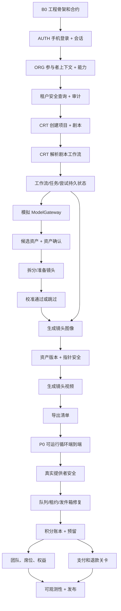

# P0 能力交付执行系统

> 状态：v1 交付操作系统  
> 日期：2026-05-21  
> 范围：ReelMate 风格的 AI 漫画剧创作循环  
> 输入：`docs/product/reelmate-core-replication-prd.md`、`docs/architecture/p0-module-implementation-blueprint.md`、`docs/architecture/p0-delivery-execution-system.md`、`apps/backend/src/modules` 下的当前后端模块、`packages/contracts` 下的当前合约。

本文档将模块蓝图转化为团队可每日运行、每周验证的执行系统。

它不是代码层的任务列表。它围绕交付的能力、依赖顺序、验证关卡、风险暴露和发布就绪程度进行组织。

## 0. 运作规则

每个任务在进入开发前必须回答五个问题：

```text
它交付了什么用户或操作者能力？
它依赖于什么？
它改变了哪些数据和状态？
我们如何证明它能工作？
它为最小可运行循环降低了什么风险？
```

一个任务不是因为代码存在就完成了。只有当行为可测试、可观察、且根据任务卡被验收通过才算完成。

## 1. 可交付物 1：最小可运行循环

### 1.1 第一个闭环

第一个里程碑是一个真正的垂直创作者循环：

```text
手机验证码登录
  -> 解析组织、工作空间、成员关系和能力
  -> 使用剧本文本创建项目
  -> 请求剧本解析工作流
  -> 持久化工作流、任务、尝试、提供者请求和状态
  -> 页面刷新后查询状态
  -> 从模拟提供者输出创建已解析的剧集、资产和镜头
  -> 确认关键角色和场景资产
  -> 拆分或准备镜头
  -> 带审计通过或明确跳过校准
  -> 使用模拟 ModelGateway 生成一个镜头图像
  -> 创建不可变资产版本并安全移动镜头当前指针
  -> 使用模拟 ModelGateway 生成一个镜头视频
  -> 创建导出包清单
  -> 查询最终项目就绪状态和导出状态
```

### 1.2 真实度要求

这个循环只有满足以下条件才算验收通过：

- 使用真实的 HTTP/API 入口点或命令运行时调用，而非仅前端状态。
- 通过活动数据库测试工具使用真实的迁移支持的持久化。
- 使用真实的会话守卫和后端能力检查。
- 对项目创建、剧本解析、镜头生成、视频生成和导出创建使用真实的幂等记录。
- 使用真实的工作流/任务/尝试/提供者请求状态转换。
- 在 `ModelGateway` 适配器边界后使用真实的模拟提供者。
- 使用真实的不可变资产版本。重新生成绝不能覆盖之前的输出。
- 刷新后使用真实的状态查询。Redis 或内存队列状态不能作为唯一的事实来源。
- 使用真实的结构化日志，至少携带 `traceId`、`organizationId`、`workspaceId`、`projectId` 以及适用的任务/工作流 ID。
- 在仓库测试运行器中有真实的测试：`npm test -- <target>`。

### 1.3 第一个循环的非目标

第一个循环有意排除：

- 真实的付费提供者调用。
- 真实的支付、退款、发票或优惠券流程。
- 完整的团队成员管理。
- 完整的资产市场或团队资产库。
- 像素级 ReelMate UI 复制。

这些并非被忽略。它们被安排在循环验证了认证、租户范围、持久化、工作流状态、幂等性、模拟生成、资产版本化、导出和可观测性之后。

## 2. 可交付物 2：能力分解

### 2.1 能力分组

| 史诗 | 能力 ID | 能力 | 负责人 | 业务价值 | 技术风险 | 首次验证 |
| --- | --- | --- | --- | --- | --- | --- |
| 基础 | FND-01 | 迁移支持的数据库工具 | Platform/DB | 高 | 高 | 模式测试和持久化测试本地运行 |
| 基础 | FND-02 | 合约注册表和操作名称 | Contracts | 高 | 高 | `packages/contracts/api/contracts.spec.ts` |
| 基础 | FND-03 | 持久化幂等性辅助 | Shared | 高 | 高 | 重放、冲突、并发首次请求 |
| 基础 | FND-04 | 统一错误响应和错误码 | API/Shared | 高 | 中 | API 负面测试断言稳定码 |
| 基础 | FND-05 | 追踪/日志上下文传播 | API/Ops | 中 | 高 | 失败时日志包含所需的 ID |
| 基础 | FND-06 | 审计追加辅助 | Audit | 中 | 中 | 敏感命令写入审计事件 |
| 身份 | AUTH-01 | 手机验证码签发和验证 | Identity | 高 | 高 | 有效、过期、错误、已消费、禁用用户 |
| 身份 | AUTH-02 | 服务端会话守卫 | Identity | 高 | 高 | 未认证请求在领域写入前失败 |
| 组织 | ORG-01 | 参与者上下文解析器 | Organization | 高 | 高 | 用户/组织/工作空间/成员关系解析 |
| 组织 | ORG-02 | 能力断言 | Organization | 高 | 高 | 缺失能力的 403 测试 |
| 组织 | ORG-03 | 租户安全查询辅助 | Shared/DB | 高 | 高 | 跨租户负面测试 |
| 创作者 | CRT-01 | 使用剧本输入创建项目 | Project | 高 | 高 | `CreateProject` 重放和冲突 |
| 创作者 | CRT-02 | 解析剧本工作流 | Project, Workflow, ModelGateway | 高 | 高 | 状态在刷新后存活，重复解析返回同一工作流 |
| 创作者 | CRT-03 | 提取候选资产 | Project/Asset | 高 | 中 | 创建候选角色、场景、道具行 |
| 创作者 | CRT-04 | 确认和编辑关键资产 | Asset Review | 高 | 中 | 关键角色/场景关卡可以通过和失败 |
| 创作者 | CRT-05 | 拆分或准备镜头 | Project/Shot | 高 | 高 | 创建具有稳定顺序和状态的镜头 |
| 创作者 | CRT-06 | 校准通过/跳过关卡 | Calibration/Audit | 高 | 中 | 后端阻止批量生成直到关卡存在 |
| 创作者 | CRT-07 | 生成一个镜头图像 | Shot, Workflow, ModelGateway, Asset | 高 | 高 | 模拟提供者结果创建资产版本 |
| 创作者 | CRT-08 | 生成一个镜头视频 | Shot, Workflow, ModelGateway, Asset | 高 | 高 | 需要当前图像；创建视频版本 |
| 创作者 | CRT-09 | 导出包清单 | Export | 高 | 中 | 缺失资产明确；清单就绪 |
| 资产库 | AST-01 | 个人/项目资产查询 | Asset | 中 | 中 | 按项目/类型/来源/状态过滤 |
| 资产库 | AST-02 | 团队资产权益关卡 | Asset/Organization | 中 | 中 | 后端强制执行专业版/团队权限 |
| 团队 | TEAM-01 | 成员角色和权限模型 | Organization | 中 | 高 | 角色矩阵映射到能力 |
| 团队 | TEAM-02 | 成员创建的席位/套餐关卡 | Organization/Billing | 中 | 中 | 席位不可用时创建成员被阻止 |
| 积分 | CRD-01 | 积分余额读取模型 | Credit | 高 | 高 | 账本重算匹配缓存余额 |
| 积分 | CRD-02 | 生成预留和结算 | Credit, Workflow | 高 | 高 | 无超卖，单次消费/释放 |
| 提供者 | PRV-01 | 外部调用前持久化提供者请求 | ModelGateway | 高 | 高 | 提交后崩溃产生 `result_unknown` |
| 提供者 | PRV-02 | 外部提交后无盲重重试 | ModelGateway, Workflow | 高 | 高 | 恢复不会双重提交 |
| 运维 | OPS-01 | 卡住工作流修复 | Workflow/Ops | 高 | 高 | 修复队列丢失和租约过期 |
| 运维 | OPS-02 | 人工审核和结算 | Admin/Ops | 高 | 高 | 未解决的提供者/积分状态可见 |
| 发布 | REL-01 | CI 关卡和预演环境预演 | Infra/Ops | 高 | 中 | 合约、单元、集成、P0 端到端 |
| 发布 | REL-02 | 指标、仪表盘、告警、运行手册 | Ops | 高 | 高 | 事故演练可定位任务/支付/提供者问题 |

### 2.2 每个任务的能力合约

每个能力任务必须指定：

```text
输入：
输出：
读取的数据：
写入的数据：
状态转换：
命令合约：
事件合约：
权限：
幂等性：
失败行为：
日志/指标：
测试：
验收：
```

如果任务无法填写这些字段，则未准备好进行开发。

## 3. 可交付物 3：依赖关系图



关键路径：

```text
B0 -> 认证 -> 组织 -> 租户范围 -> 项目 -> 工作流 -> 模拟提供者 -> 资产/镜头 -> 校准 -> 图像 -> 视频 -> 导出 -> 提供者安全 -> 修复 -> 积分 -> 发布
```

在此路径之外的工作只有在不会饿死该路径或能够降低高风险依赖时才被允许。

## 4. 可交付物 4：开发批次

| 批次 | 目标 | 主要输出 | 出口关卡 |
| --- | --- | --- | --- |
| B0 | 工程骨架 | 合约、迁移工具、测试运行器、错误/日志基线 | `npm test -- packages/contracts` 和模式冒烟测试通过 |
| B1 | 租户安全平台 | 登录、会话、参与者上下文、能力、审计 | 受保护命令正确拒绝 401/403，租户泄漏测试通过 |
| B2 | 项目和工作流主干 | 创建项目、剧本解析工作流、持久状态 | 创建 -> 解析 -> 状态查询在刷新后存活 |
| B3 | 资产和分镜板关闭 | 候选资产、确认、镜头拆分、校准 | 后端关卡阻止生成直到资产/校准有效 |
| B4 | 图像/视频生成循环 | 一个模拟图像和一个模拟视频生成不可变版本 | 重复生成没有重复任务/输出；过期输出不能移动指针 |
| B5 | 导出和 P0 演示 | 清单导出和完整循环端到端 | 登录 -> 项目 -> 解析 -> 确认 -> 镜头 -> 图像 -> 视频 -> 导出通过 |
| B6 | 外部提供者安全 | 提供者请求持久化、未知处理、无盲重重试 | 崩溃/超时矩阵在真实提供者内测前通过 |
| B7 | 可靠性和修复 | 队列修复、租约修复、发件箱重放、人工审核 | 卡住任务和结果未知演练可恢复 |
| B8 | 积分和权益 | 积分账本、预留、结算、团队/席位关卡 | 无超卖、单次结算、权益测试通过 |
| B9 | 商业和发布加固 | 支付、退款、发票、仪表盘、告警、发布预演 | 重复回调一次授权；回滚和可观测性演练通过 |

### 每周里程碑节奏

| 周 | 里程碑 | 每周演示 | 不得推迟超过该周 |
| --- | --- | --- | --- |
| W1 | B0/B1 | 登录和受保护命令拒绝 | 租户范围和能力检查 |
| W2 | B2 | 创建项目和解析后刷新状态 | 项目和解析的幂等性 |
| W3 | B3/B4 | 从已解析镜头生成一个图像 | 资产版本和指针安全 |
| W4 | B5 | 完整 P0 模拟循环导出 | 端到端测试和演示脚本 |
| W5 | B6/B7 | 提供者崩溃和修复演练 | 外部启动后无盲重重试 |
| W6 | B8 | 积分预留和权益关卡 | 无超卖和单次结算 |
| W7 | B9 | 预演环境发布预演 | 仪表盘、告警、回滚运行手册 |

## 5. 可交付物 5：任务卡列表

在 GitHub、Linear 或本地 markdown 问题中使用此精确的卡片格式。

```text
任务名称：
史诗：
能力：
批次：
业务价值：
技术风险：
负责人：
评审者：
前置条件：
输入：
输出：
读取的数据：
写入的数据：
命令合约：
事件合约：
状态转换：
异常场景：
幂等性：
安全性：
可观测性：
测试：
验收标准：
完成定义：
阻塞：
被阻塞于：
```

### B0-T01：锁定合约和测试运行器基线

| 字段 | 内容 |
| --- | --- |
| 史诗 | 基础 |
| 能力 | FND-02 |
| 批次 | B0 |
| 业务价值 / 技术风险 | 高 / 高 |
| 负责人 | Platform |
| 前置条件 | `packages/contracts` 下现有合约 |
| 输入 | `packages/contracts/api/*.ts`、`packages/contracts/domain/*.ts`、`packages/contracts/events/*.ts` |
| 输出 | 可执行合约基线 |
| 读取/写入的数据 | 无 |
| 命令合约 | 所有 P0 API 命令合约 |
| 事件合约 | 所有 P0 事件合约 |
| 异常场景 | 缺少操作名称、缺少验证 ID、昂贵命令非幂等 |
| 幂等性 | 合约元数据必须标记昂贵命令为幂等 |
| 安全性 | 每个命令都需要能力 |
| 可观测性 | 测试输出按命令名称识别漂移 |
| 测试 | `npm test -- packages/contracts` |
| 验收标准 | 每个操作名称有一个命令合约；每个命令有能力和状态前置条件、业务错误、验证 ID |
| 完成定义 | 测试通过，漂移规则已记录，PR 链接合约关卡 |
| 阻塞 | 所有 API 实现任务 |

### B1-T01：手机验证码登录签发和验证

| 字段 | 内容 |
| --- | --- |
| 史诗 | 身份 |
| 能力 | AUTH-01 |
| 批次 | B1 |
| 业务价值 / 技术风险 | 高 / 高 |
| 负责人 | Identity |
| 前置条件 | `login_challenges`、`auth_sessions`、用户迁移 |
| 输入 | 手机号、用途、验证码 |
| 输出 | 服务器控制的活跃会话 |
| 读取的数据 | `users`、`login_challenges` |
| 写入的数据 | `login_challenges`、`auth_sessions`、`users.last_login_at` |
| 命令合约 | 如果通过公共 API 暴露，需要添加认证命令结构 |
| 事件合约 | 可选 `auth.login_succeeded` 审计事件 |
| 状态转换 | `login_challenges.issued -> consumed`；`auth_sessions.active` |
| 异常场景 | 无效手机、错误验证码、过期验证码、已消费验证码、禁用用户、速率限制 |
| 幂等性 | 签发按手机/IP 限流；验证一次消费一个挑战一次 |
| 安全性 | 哈希验证码和会话令牌；在日志中掩码手机号 |
| 可观测性 | `traceId`、掩码手机号、挑战结果、速率限制桶 |
| 测试 | 登录签发、验证成功、过期、错误、已消费、禁用用户 |
| 验收标准 | 一个验证码不能创建多个会话；明文验证码/令牌永不持久化 |
| 完成定义 | 服务、处理器、持久化测试、API 测试、错误、日志 |
| 阻塞 | 参与者上下文和所有受保护命令 |

### B1-T02：参与者上下文和能力解析器

| 字段 | 内容 |
| --- | --- |
| 史诗 | 组织 |
| 能力 | ORG-01、ORG-02、ORG-03 |
| 批次 | B1 |
| 业务价值 / 技术风险 | 高 / 高 |
| 负责人 | Organization |
| 前置条件 | 活跃会话 |
| 输入 | 会话令牌、组织/工作空间范围 |
| 输出 | 包含用户、组织、工作空间、成员关系、能力的 `ActorContext` |
| 读取的数据 | `users`、`organizations`、`workspaces`、`memberships` |
| 写入的数据 | 无，除非需要在被拒绝的敏感操作上审计 |
| 命令合约 | 所有受保护命令消费 `capability` 元数据 |
| 事件合约 | 无 |
| 状态转换 | 无 |
| 异常场景 | 无会话、禁用用户、暂停组织、归档工作空间、缺少成员关系、缺少能力 |
| 幂等性 | 只读 |
| 安全性 | 每个后端命令调用 `assertCapability`；UI 隐藏不是安全 |
| 可观测性 | `traceId`、`userId`、`organizationId`、拒绝原因 |
| 测试 | 401、403、禁用用户/组织/成员、租户泄漏负面测试 |
| 验收标准 | 未授权请求永不到达领域写入路径 |
| 完成定义 | 解析器、守卫、测试夹具、负面测试、日志 |
| 阻塞 | 项目、生成、导出、团队、计费命令 |

### B2-T01：使用剧本输入创建项目

| 字段 | 内容 |
| --- | --- |
| 史诗 | 创作者 |
| 能力 | CRT-01 |
| 批次 | B2 |
| 业务价值 / 技术风险 | 高 / 高 |
| 负责人 | Project |
| 前置条件 | B1-T02、持久化幂等性 |
| 输入 | 工作空间 ID、项目名称、剧本文本或上传的资产、宽高比、分辨率 |
| 输出 | 项目 ID、剧本 ID、初始项目阶段 |
| 读取的数据 | 工作空间和成员关系范围 |
| 写入的数据 | `projects`、`scripts`、`idempotency_records`、`audit_events` |
| 命令合约 | `packages/contracts/api/project.commands.ts` 中的 `CreateProject` |
| 事件合约 | 可选 `project.created` |
| 状态转换 | 无 -> `project.project_phase = script_input`；`script.status = ready` |
| 异常场景 | 无效输入、缺少工作空间、禁止、重复键冲突 |
| 幂等性 | `(organization_id, project.create, idempotency_key)` 带请求哈希 |
| 安全性 | `project:create`；租户范围的工作空间 |
| 可观测性 | `traceId`、`organizationId`、`workspaceId`、`projectId`、参与者 |
| 测试 | 成功、无效输入、重放、冲突、禁止、租户不匹配 |
| 验收标准 | 重放返回同一项目；冲突重放返回稳定的 409；项目和剧本一起持久化 |
| 完成定义 | 命令、仓库/存储、测试、错误文档、审计/日志 |
| 阻塞 | 剧本解析工作流 |

### B2-T02：使用模拟提供者解析剧本工作流

| 字段 | 内容 |
| --- | --- |
| 史诗 | 创作者 |
| 能力 | CRT-02、FND-03 |
| 批次 | B2 |
| 业务价值 / 技术风险 | 高 / 高 |
| 负责人 | Project、Workflow、ModelGateway |
| 前置条件 | B2-T01、工作流/任务表、模拟提供者适配器 |
| 输入 | 项目 ID、剧本 ID |
| 输出 | 工作流 ID、任务 ID、持久解析状态 |
| 读取的数据 | `projects`、`scripts`、活跃工作流/幂等性记录 |
| 写入的数据 | `workflows`、`tasks`、`task_attempts`、`provider_requests`、`episodes`、候选 `assets`、`shots` |
| 命令合约 | `ParseScript` |
| 事件合约 | `task.succeeded`、`workflow.completed` |
| 状态转换 | `script.ready -> parsing -> parsed/failed`；工作流 `queued -> running -> succeeded/failed` |
| 异常场景 | 重复解析、剧本未就绪、提供者模拟失败、最终确定前工作进程崩溃 |
| 幂等性 | `script.parse` 重复运行中的请求返回同一工作流 |
| 安全性 | `project:edit` |
| 可观测性 | `workflowId`、`taskId`、`attemptId`、解析阶段、提供者请求 ID |
| 测试 | 成功、重复运行中的解析、解析失败、状态在刷新后存活、最终确定失败时回滚 |
| 验收标准 | 页面刷新永不创建重复工作流；PostgreSQL 状态是权威的 |
| 完成定义 | 命令、工作进程路径、模拟提供者、测试、日志 |
| 阻塞 | 资产确认和镜头拆分 |

### B3-T01：资产提取和确认关卡

| 字段 | 内容 |
| --- | --- |
| 史诗 | 创作者 |
| 能力 | CRT-03、CRT-04 |
| 批次 | B3 |
| 业务价值 / 技术风险 | 高 / 中 |
| 负责人 | Asset Review |
| 前置条件 | 带有候选资产的已解析剧本输出 |
| 输入 | 候选角色、场景、道具资产；用户编辑和确认 |
| 输出 | 已确认的关键资产和审核状态 |
| 读取的数据 | `assets`、已解析的剧集/镜头 |
| 写入的数据 | `assets.status`、`assets.description`、`assets.is_key_asset`、`audit_events` |
| 命令合约 | 资产审核命令，或扩展项目命令合约 |
| 事件合约 | 如果事件消费者需要，`asset.confirmed` |
| 状态转换 | 资产 `pending -> confirmed/needs_fix`；项目就绪度 `assets_pending -> assets_reviewing` |
| 异常场景 | 缺少关键角色、缺少主要场景、无效资产编辑、未授权确认 |
| 幂等性 | 如果请求哈希匹配，确认命令重放是无操作的 |
| 安全性 | `project:edit` |
| 可观测性 | `assetId`、资产类型、关键标志、参与者 |
| 测试 | 确认角色、编辑描述、阻止缺少关键资产、禁止、审计 |
| 验收标准 | 当所需关键资产未确认时，后端阻止镜头生成 |
| 完成定义 | API/命令、服务、测试、审计/日志 |
| 阻塞 | 镜头准备和校准 |

### B3-T02：拆分或准备镜头

| 字段 | 内容 |
| --- | --- |
| 史诗 | 创作者 |
| 能力 | CRT-05 |
| 批次 | B3 |
| 业务价值 / 技术风险 | 高 / 高 |
| 负责人 | Project/Shot |
| 前置条件 | 已解析的剧本和资产审核关卡 |
| 输入 | 项目 ID、剧本 ID、剧集结构 |
| 输出 | 带有内容状态和生成就绪性的有序镜头 |
| 读取的数据 | `episodes`、已确认的资产 |
| 写入的数据 | `shots`、`shot_asset_links`、如果是异步的则包括工作流/任务行 |
| 命令合约 | `SplitShots` |
| 事件合约 | 如果异步则为 `shots.split_completed` |
| 状态转换 | 项目就绪度 `assets_reviewing -> shots_ready`；镜头 `draft -> ready` |
| 异常场景 | 无已解析剧本、关键资产不完整、重复拆分、部分失败 |
| 幂等性 | `shots.split` 返回现有工作流或当前镜头集合 |
| 安全性 | `project:edit` |
| 可观测性 | `projectId`、`episodeId`、镜头计数、失败计数 |
| 测试 | 成功、重复拆分、缺少资产阻止、稳定排序 |
| 验收标准 | 重复拆分不能为同一剧本修订版创建重复镜头行 |
| 完成定义 | 命令、存储、测试、日志 |
| 阻塞 | 校准和生成 |

### B3-T03：校准通过或跳过关卡

| 字段 | 内容 |
| --- | --- |
| 史诗 | 创作者 |
| 能力 | CRT-06 |
| 批次 | B3 |
| 业务价值 / 技术风险 | 高 / 中 |
| 负责人 | Calibration/Audit |
| 前置条件 | 就绪镜头 |
| 输入 | 三个代表性镜头 ID 或明确的跳过原因 |
| 输出 | 持久校准会话和决策 |
| 读取的数据 | `shots`、当前资产引用 |
| 写入的数据 | `calibration_sessions`、`calibration_items`、`calibration_decisions`、`audit_events` |
| 命令合约 | `packages/contracts/api/calibration.commands.ts` 中的校准命令 |
| 事件合约 | `calibration.passed` |
| 状态转换 | `draft/generating/ready_for_review -> passed/skipped/failed` |
| 异常场景 | 少于三个镜头、无效镜头范围、校准失败、未授权跳过 |
| 幂等性 | generate/pass/skip 的操作名称 |
| 安全性 | `project:edit`；如果策略要求，跳过需要提升角色 |
| 可观测性 | `calibrationSessionId`、选定的镜头 ID、决策、参与者 |
| 测试 | 通过、跳过、无效计数、禁止、通过/跳过前生成被阻止 |
| 验收标准 | 在持久关卡存在之前，`GenerateShotImage` 以 `calibration_required` 失败 |
| 完成定义 | 服务、命令、测试、审计/日志 |
| 阻塞 | 批量图像生成 |

### B4-T01：使用模拟提供者生成镜头图像

| 字段 | 内容 |
| --- | --- |
| 史诗 | 创作者 |
| 能力 | CRT-07 |
| 批次 | B4 |
| 业务价值 / 技术风险 | 高 / 高 |
| 负责人 | Shot、Workflow、ModelGateway、Asset |
| 前置条件 | 就绪镜头、校准通过/跳过、提供者模拟 |
| 输入 | 镜头 ID、提示覆写、幂等性键 |
| 输出 | 工作流 ID、任务 ID、已完成的图像资产版本 |
| 读取的数据 | `shots`、校准状态、资产上下文、积分可用性占位符 |
| 写入的数据 | `workflows`、`tasks`、`task_attempts`、`provider_requests`、`assets`、`asset_versions`、`shots.current_image_asset_version_id` |
| 命令合约 | `GenerateShotImage` |
| 事件合约 | `task.succeeded`、`asset.version.created` |
| 状态转换 | 镜头图像 `ready/failed/stale -> generating -> completed/failed` |
| 异常场景 | 校准缺失、镜头未就绪、重复运行中的生成、提供者失败、过期完成 |
| 幂等性 | `shot.image.generate` 加活跃任务/内容修订版守卫 |
| 安全性 | `generation:start` |
| 可观测性 | `workflowId`、`taskId`、`attemptId`、`providerRequestId`、`shotId`、版本 ID |
| 测试 | 成功、重复运行中、提供者失败、过期完成不能移动指针、重放 |
| 验收标准 | 重新创建新版本且绝不覆盖旧输出 |
| 完成定义 | 命令、模拟提供者、最终确定、测试、日志 |
| 阻塞 | 镜头视频生成和导出 |

### B4-T02：使用模拟提供者生成镜头视频

| 字段 | 内容 |
| --- | --- |
| 史诗 | 创作者 |
| 能力 | CRT-08 |
| 批次 | B4 |
| 业务价值 / 技术风险 | 高 / 高 |
| 负责人 | Shot、Workflow、ModelGateway、Asset |
| 前置条件 | 已完成的当前镜头图像 |
| 输入 | 镜头 ID、运动提示、模型选项、幂等性键 |
| 输出 | 工作流 ID、任务 ID、已完成的视频资产版本 |
| 读取的数据 | `shots.current_image_asset_version_id`、图像资产元数据 |
| 写入的数据 | `workflows`、`tasks`、`task_attempts`、`provider_requests`、`asset_versions`、`shots.current_video_asset_version_id` |
| 命令合约 | `GenerateShotVideo` |
| 事件合约 | `task.succeeded`、`asset.version.created` |
| 状态转换 | 镜头视频 `ready/failed/stale -> generating -> completed/failed` |
| 异常场景 | 无当前图像、重复运行中的生成、提供者失败、过期的图像版本 |
| 幂等性 | `shot.video.generate` 加源图像版本守卫 |
| 安全性 | `generation:start` |
| 可观测性 | `workflowId`、`taskId`、`shotId`、源图像版本、视频版本 |
| 测试 | 成功、缺少图像阻止、重放、过期源阻止指针移动 |
| 验收标准 | 没有持久的当前图像版本，视频生成无法启动 |
| 完成定义 | 命令、服务、测试、日志 |
| 阻塞 | 导出完整性和 P0 演示 |

### B5-T01：导出包清单

| 字段 | 内容 |
| --- | --- |
| 史诗 | 创作者 |
| 能力 | CRT-09 |
| 批次 | B5 |
| 业务价值 / 技术风险 | 高 / 中 |
| 负责人 | Export |
| 前置条件 | 至少一个已完成的图像或视频资产 |
| 输入 | 项目 ID、导出范围、允许不完整标志 |
| 输出 | 导出记录和清单 |
| 读取的数据 | `projects`、`episodes`、`shots`、`assets`、`asset_versions` |
| 写入的数据 | `exports`、清单元数据、审计事件 |
| 命令合约 | `CreateExport` |
| 事件合约 | `export.ready` |
| 状态转换 | 导出 `preparing -> ready/failed` |
| 异常场景 | 缺少资产、无可导出镜头、重复请求、禁止 |
| 幂等性 | `export.create` 操作名称 |
| 安全性 | `export:create` |
| 可观测性 | `exportId`、清单项计数、缺失计数 |
| 测试 | 成功、缺少资产明确、无静默失败、重放 |
| 验收标准 | 导出可以作为最小循环的最终结果被演示 |
| 完成定义 | 命令、清单服务、测试、日志 |
| 阻塞 | P0 可运行循环验收 |

### B5-T02：P0 可运行循环端到端

| 字段 | 内容 |
| --- | --- |
| 史诗 | 发布 |
| 能力 | REL-01 |
| 批次 | B5 |
| 业务价值 / 技术风险 | 高 / 高 |
| 负责人 | QA/Platform |
| 前置条件 | B1 到 B5 任务出口关卡 |
| 输入 | 带有手机用户、工作空间、剧本文本的脚本化测试夹具 |
| 输出 | 可重复的端到端测试和演示脚本 |
| 读取/写入的数据 | 完整 P0 循环数据集 |
| 命令合约 | 所有 P0 循环命令 |
| 事件合约 | 工作流/任务/导出事件 |
| 状态转换 | 完整的项目生命周期直到导出就绪 |
| 异常场景 | 一个注入的提供者失败、一个重复重放、一个运行任务中的刷新 |
| 幂等性 | 端到端重复不能从相同的幂等键创建重复的昂贵工作 |
| 安全性 | 测试包括一次禁止的租户访问尝试 |
| 可观测性 | 一个追踪 ID 跟随演示路径 |
| 测试 | `npm test -- p0-loop` 或添加后的等效目标 |
| 验收标准 | 团队可以每周从一个干净夹具演示循环 |
| 完成定义 | 端到端已提交、文档已更新、演示路径已记录 |
| 阻塞 | 真实提供者内测 |

### B6-T01：提供者副作用保护

| 字段 | 内容 |
| --- | --- |
| 史诗 | 提供者 |
| 能力 | PRV-01、PRV-02 |
| 批次 | B6 |
| 业务价值 / 技术风险 | 高 / 高 |
| 负责人 | ModelGateway |
| 前置条件 | 模拟生成循环 |
| 输入 | 提供者载荷、任务/尝试上下文 |
| 输出 | 外部调用前持久化的提供者请求和明确的未知处理 |
| 读取的数据 | 任务/尝试/提供者配置 |
| 写入的数据 | `provider_requests`、任务/尝试状态 |
| 命令合约 | 内部提供者提交合约 |
| 事件合约 | 如果存在异步回调，提供者结果事件 |
| 状态转换 | 提供者请求 `created/submitted/accepted -> succeeded/failed/result_unknown` |
| 异常场景 | 提交前崩溃、提交后崩溃、接受前超时、接受后超时 |
| 幂等性 | 提供者客户端请求 ID；`external_submission_started_at` 之后无盲重重试 |
| 安全性 | 提供者密钥永不记录；必要时对载荷进行编辑 |
| 可观测性 | `providerRequestId`、提供者、模型、能力、重试决策 |
| 测试 | 崩溃前、崩溃后、无盲重重试、upsert 并发 |
| 验收标准 | 外部提交后的恢复自动永不创建第二个提供者请求 |
| 完成定义 | 适配器策略、测试、日志、运行手册备注 |
| 阻塞 | 真实提供者内测 |

### B7-T01：工作流修复和人工审核

| 字段 | 内容 |
| --- | --- |
| 史诗 | 运维 |
| 能力 | OPS-01、OPS-02 |
| 批次 | B7 |
| 业务价值 / 技术风险 | 高 / 高 |
| 负责人 | Workflow/Ops |
| 前置条件 | 持久工作流/任务/尝试状态和提供者未知处理 |
| 输入 | 卡住的排队/运行中/结果未知的工作流 |
| 输出 | 已修复的任务、人工审核记录或安全的无操作 |
| 读取的数据 | 工作流、任务、尝试、提供者请求、发件箱 |
| 写入的数据 | 任务/工作流状态、修复审计、发件箱重试元数据 |
| 命令合约 | 管理员/运维修复命令 |
| 事件合约 | 修复/重试事件 |
| 状态转换 | 卡住状态 -> queued/running/manual_review_required/succeeded/failed |
| 异常场景 | Redis 丢失、工作进程租约过期、双重声明、最终确定回滚、发件箱重放 |
| 幂等性 | 重复修复作业产生相同的最终结果或无操作 |
| 安全性 | `ops:settle`；所有手动操作均被审计 |
| 可观测性 | 卡住持续时间、修复原因、操作者/系统参与者 |
| 测试 | Redis 丢失、租约修复、任务声明并发、人工审核聚合 |
| 验收标准 | 没有卡住状态是不可见的；修复从不绕过领域所有权 |
| 完成定义 | 修复服务、管理员命令、测试、运行手册 |
| 阻塞 | 发布就绪 |

### B8-T01：积分预留和结算

| 字段 | 内容 |
| --- | --- |
| 史诗 | 积分 |
| 能力 | CRD-01、CRD-02 |
| 批次 | B8 |
| 业务价值 / 技术风险 | 高 / 高 |
| 负责人 | Credit/Billing |
| 前置条件 | 生成工作流和任务分配模型 |
| 输入 | 生成估计、组织余额、任务分配 |
| 输出 | 已预留积分、单次消费/释放结算、更新后的余额 |
| 读取的数据 | 积分账本、预留、任务 |
| 写入的数据 | `credit_ledger_entries`、`credit_reservations`、分配行、余额读取模型 |
| 命令合约 | 生成命令在任务创建前调用积分预留 |
| 事件合约 | 任务成功/失败结算事件 |
| 状态转换 | 预留 `active -> settled/released/manual_review_required` |
| 异常场景 | 积分不足、并发生成、重复最终确定、未知提供者结果 |
| 幂等性 | 每个任务分配的唯一结算 |
| 安全性 | 租户范围的余额和账本读取 |
| 可观测性 | 预留 ID、分配 ID、结算前后余额、结算类型 |
| 测试 | 无超卖、单次结算、重复最终确定、账本重算 |
| 验收标准 | 并发生成不能超卖，重复最终确定不能双重收费 |
| 完成定义 | 服务、模式约束、测试、对账运行手册 |
| 阻塞 | 付费测试版和商业发布 |

### B8-T02：团队席位和权益关卡

| 字段 | 内容 |
| --- | --- |
| 史诗 | 团队 |
| 能力 | TEAM-01、TEAM-02、AST-02 |
| 批次 | B8 |
| 业务价值 / 技术风险 | 中 / 高 |
| 负责人 | Organization/Billing |
| 前置条件 | 能力解析器、积分/套餐读取模型 |
| 输入 | 创建成员请求、角色、工作空间/项目分配 |
| 输出 | 成员已创建或因权益原因被阻止 |
| 读取的数据 | 组织、成员关系、套餐/席位权益、团队资产权益 |
| 写入的数据 | 成员关系、审计事件、可选邀请记录 |
| 命令合约 | 待添加的团队成员命令 |
| 事件合约 | 如果需要 `member.created` |
| 状态转换 | 无 -> 成员关系活跃/已邀请，或被阻止 |
| 异常场景 | 无可用席位、套餐不足、重复成员、无效角色、禁止 |
| 幂等性 | 按组织/用户或受邀身份创建的成员键 |
| 安全性 | 拥有者/管理员能力；角色不能授予超过参与者自身拥有的权限 |
| 可观测性 | `organizationId`、参与者、目标用户、角色、阻止原因 |
| 测试 | 席位可用、无席位、角色禁止、重复、团队资产库关卡 |
| 验收标准 | 后端强制执行在 ReelMate 截图中看到的相同关卡：成员创建和团队资产需要权益 |
| 完成定义 | 命令、测试、审计/日志、错误文档 |
| 阻塞 | 团队管理 UI 完成 |

### B9-T01：发布可观测性和回滚关卡

| 字段 | 内容 |
| --- | --- |
| 史诗 | 发布 |
| 能力 | REL-01、REL-02 |
| 批次 | B9 |
| 业务价值 / 技术风险 | 高 / 高 |
| 负责人 | Ops/Infra |
| 前置条件 | P0 端到端、修复运行手册、积分关卡 |
| 输入 | 预演环境部署、已播种测试组织、发布候选 |
| 输出 | 仪表盘、告警规则、回滚运行手册、预演环境预演记录 |
| 读取/写入的数据 | 运维指标和日志；预演外无领域写入 |
| 命令合约 | 无 |
| 事件合约 | 监控消费工作流/提供者/积分/支付事件 |
| 状态转换 | 发布候选 -> staging -> approved/blocked |
| 异常场景 | 迁移失败、端到端失败、缺少告警、回滚失败 |
| 幂等性 | 发布脚本安全可重跑或明确快速失败 |
| 安全性 | 密钥已编辑、最小权限部署令牌 |
| 可观测性 | API 延迟、任务队列深度、提供者未知计数、积分漂移、错误率 |
| 测试 | 预演冒烟、回滚演练、可观测性演练、安全冒烟 |
| 验收标准 | 值班人员可以回答：什么失败了、谁受影响、能否重试、能否回滚 |
| 完成定义 | 仪表盘、告警、运行手册、预演证据 |
| 阻塞 | 公开/测试版发布 |

## 6. 可交付物 6：验收标准和测试用例

### 6.1 全局完成定义

每个标记为完成的任务必须满足：

- 代码或文档变更已提交到正确的模块边界内。
- 存在快乐路径测试。
- 核心任务至少有一个有意义的负面测试。
- 在数据为租户所有的地方测试了权限和租户范围。
- 在副作用可能重复的地方测试了幂等性。
- 错误响应使用稳定的业务错误。
- 日志包含诊断失败所需的 ID。
- 数据库更改已迁移并覆盖了持久化/模式测试。
- 接口或状态变更更新了合约/文档。
- 任务已通过自测，准备集成。

### 6.2 最小测试矩阵

| 能力 | 正常路径 | 边界路径 | 异常路径 |
| --- | --- | --- | --- |
| 手机登录 | 有效验证码创建会话 | 验证码在 TTL 时精确过期 | 错误/已消费/禁用用户被拒绝 |
| 参与者上下文 | 活跃成员解析能力 | 仅工作空间级成员关系 | 跨租户访问被拒绝 |
| 创建项目 | 有效剧本创建项目/剧本 | 最大长度项目名称 | 重复键冲突、禁止 |
| 解析剧本 | 模拟提供者创建剧集/资产/镜头 | 重复运行中的解析 | 提供者失败、最终确定回滚 |
| 资产确认 | 确认关键角色和场景 | 可选道具未确认 | 缺少关键资产阻止下一阶段 |
| 镜头拆分 | 已解析剧本创建有序镜头 | 最后一个剧集只有一个镜头 | 重复拆分、缺少剧本 |
| 校准 | 三个镜头通过 | 带原因的明确跳过 | 少于三个、未授权跳过 |
| 图像生成 | 完成的图像创建版本 | 重新生成过期的镜头 | 校准缺失、重复任务、过期输出 |
| 视频生成 | 当前图像创建视频 | 省略提示使用默认 | 缺少当前图像、过期源图像 |
| 导出 | 清单就绪 | 带确认的不完整导出 | 缺少资产列出、无静默失败 |
| 提供者安全 | 提交和最终确定成功 | 接受前超时 | 提交后崩溃 -> 结果未知、无盲重重试 |
| 积分结算 | 预留和消费一次 | 最后一个可用积分 | 不足、重复最终确定、未知结果 |
| 团队关卡 | 有席位创建成员 | 最后一个可用席位 | 无席位/专业版套餐以明确错误阻止 |
| 发布 | 预演冒烟通过 | 无操作部署后的回滚预演 | 迁移失败阻止发布 |

### 6.3 集成任务

| 任务 | 批次 | 退出条件 |
| --- | --- | --- |
| API 合约到后端命令接线审查 | B1-B2 | 每个命令路由调用命令运行时、参与者上下文、需要时的幂等性 |
| 前端壳到真实 API 集成 | B2-B5 | 没有 P0 路径使用模拟仅前端状态 |
| 工作进程/模拟提供者集成 | B2-B4 | 任务通过持久状态转换 |
| 资产版本和签名 URL 集成 | B4-B5 | 生成的版本可以通过租户安全访问查询 |
| 端到端夹具播种和清理 | B5 | 测试可以重复运行而不污染状态 |
| 提供者内测预演 | B6 | 没有持久化提供者请求就不会发生真实提供者调用 |
| 积分预留集成 | B8 | 生成命令在任务创建前原子地预留 |
| 发布冒烟套件 | B9 | 预演发布可以通过明确检查被批准或阻止 |

### 6.4 可观测性任务

| 领域 | 所需信号 | 关卡 |
| --- | --- | --- |
| API | 按路由/命令的请求计数、错误率、P95 延迟 | B2 |
| 认证 | 签发/验证成功/失败/限流计数 | B1 |
| 工作流 | 排队/运行中/成功/失败/结果未知计数 | B2 |
| 工作进程 | 声明计数、租约过期、重试计数、最终确定持续时间 | B4 |
| 提供者 | 提供者请求状态、未知计数、提供者延迟、编辑后错误类别 | B6 |
| 资产 | 资产版本创建计数、过期完成计数 | B4 |
| 积分 | 余额漂移、预留年龄、结算失败 | B8 |
| 团队 | 按原因的权益拒绝计数 | B8 |
| 发布 | 冒烟结果、回滚结果、部署版本 | B9 |

## 7. 风险前置机制

### 7.1 风险矩阵

| 风险 | 早期触发条件 | 前置加载任务 | 阻止规则 |
| --- | --- | --- | --- |
| 租户泄漏 | 任何没有 `organization_id` 范围的查询 | ORG-03 租户安全查询辅助 | 阻止项目/资产 PR |
| 重复昂贵任务 | 任何命令创建工作流/任务/提供者调用 | FND-03 持久幂等性 | 阻止创作者命令 PR |
| 提供者双重收费/输出 | 外部调用开始 | PRV-01/PRV-02 提供者请求持久化 | 阻止真实提供者内测 |
| 资产覆盖 | 重新生成移动当前指针 | CRT-07 资产版本/指针守卫 | 阻止 B4 出口 |
| 隐藏队列事实 | 任务状态仅存在于 Redis/内存中 | PostgreSQL 中的工作流状态 | 阻止 B2 出口 |
| 校准绕过 | UI 隐藏按钮但后端允许生成 | CRT-06 后端关卡 | 阻止 B3 出口 |
| 积分超卖 | 并发生成开始 | CRD-02 预留并发测试 | 阻止 B8 出口 |
| 团队权限升级 | 角色分配授予过多权限 | TEAM-01 角色能力矩阵 | 阻止团队管理员发布 |
| 运维不可见 | 未解决状态无诊断视图 | OPS-01/OPS-02 修复和运行手册 | 阻止 B9 发布 |
| 发布回滚失败 | 预演部署无法还原 | REL-02 回滚演练 | 阻止上线 |

### 7.2 风险评审节奏

每日：

```text
1. 哪个阻塞任务在关键路径上？
2. 哪个任务代码完成但不可测试？
3. 哪个数据模型或合约假设发生了变化？
4. 哪个高风险项没有负责人？
5. 哪个里程碑演示今天会失败？
```

每周：

```text
1. 从干净夹具演示当前最小循环。
2. 重新运行里程碑关卡测试。
3. 在低风险 UI 打磨之前评审所有高价值/高风险任务。
4. 关闭或重新分配每个阻塞项。
5. 在 `docs/architecture/contract-changes/` 中记录任何变更的合约。
```

## 8. 开发看板

### 8.1 状态

精确使用这些状态：

```text
待澄清
待开发
开发中
待自测
待联调
待测试
待验收
阻塞中
已完成
```

### 8.2 进入和退出规则

| 状态 | 进入规则 | 退出规则 |
| --- | --- | --- |
| 待澄清 | 能力存在但合约/依赖/验收不完整 | 任务卡具有所有必需字段 |
| 待开发 | 依赖已命名、测试已计划、负责人已分配 | 开发者开始工作 |
| 开发中 | 代码/文档正在更改 | 实现可编译且本地自测就绪 |
| 待自测 | 开发者说代码路径就绪 | 特定任务测试命令通过 |
| 待联调 | 后端/前端/工作进程边界存在 | 消费者可以用真实夹具调用它 |
| 待测试 | 集成完成 | QA/验收用例通过 |
| 待验收 | 测试通过且证据已附加 | 产品/技术负责人接受能力 |
| 阻塞中 | 依赖、合约、环境或决策阻塞进度 | 负责人和解除阻塞日期存在 |
| 已完成 | 验收标准、测试、文档、日志全部通过 | 无退出；仅在有回归时重新打开 |

### 8.3 每周验收包

每个每周里程碑应产出：

- 演示脚本。
- 测试命令和结果。
- 变更的合约或模式说明。
- 带有负责人的开放风险。
- 带有解除阻塞日期的阻塞项。
- 下周唯一最重要的循环进展。

## 9. 基于里程碑的交付

不要按功能堆叠发布。按循环成熟度发布。

| 里程碑 | 名称 | 用户可见声明 | 工程证明 |
| --- | --- | --- | --- |
| M1 | 租户安全访问 | "只有正确的用户才能到达工作空间。" | 认证、参与者、能力、租户测试 |
| M2 | 持久项目工作流 | "项目可以开始解析并在刷新后保持状态。" | 项目/解析/状态/幂等性测试 |
| M3 | 资产和镜头就绪 | "已解析的故事变为可确认的资产和就绪的镜头。" | 资产/镜头/校准关卡 |
| M4 | 首次生成媒体 | "一个镜头可以安全地生成图像和视频输出。" | 模拟提供者、版本化、指针安全 |
| M5 | 可导出演示 | "第一个项目可以导出包。" | P0 端到端和导出清单 |
| M6 | 安全提供者内测 | "真实提供者调用不能被盲目复制。" | 提供者崩溃/超时矩阵 |
| M7 | 可恢复操作 | "卡住的工作可以被检测和修复。" | 修复测试和运行手册 |
| M8 | 积分和团队关卡 | "生成和团队功能尊重积分和权益。" | 无超卖和权益测试 |
| M9 | 发布就绪 | "系统可以被观察、回滚和支持。" | 预演环境预演、仪表盘、回滚演练 |

## 10. 立即后续行动

1. 首先将 B0-B5 任务卡转换为看板问题。在最小循环关闭之前，不要打开广泛的团队/支付/提供者打磨工作。
2. 运行并记录当前基线测试：`npm test`。
3. 识别当前代码库中哪些 B0-B5 任务已经完成，并将其标记为 `待验收`，而不是 `已完成`，直到其验收证据被附加。
4. 为资产审核、团队成员创建以及任何当前缺少合约元数据的后端 API 添加缺失的命令合约。
5. 一旦 B2 可以创建和解析项目，立即创建 P0 循环端到端测试目标。不要等到整个循环打磨完毕。
6. 立即开始每周演示习惯：即使是一个薄的工作流状态页面也比不可见的模块进展要好。

## 11. 当前基线快照

记录于 2026-05-21。

命令：

```bash
npm test
```

结果：

```text
通过
```

从当前测试套件中观察到的覆盖范围：

| 领域 | 在测试运行中看到的证据 | 看板解读 |
| --- | --- | --- |
| 手机认证 | 签发、验证、会话 cookie、持久挑战/会话哈希、已用验证码和禁用用户检查 | B1 身份任务可在附加证据后移至 `待验收` |
| 参与者上下文和租户范围 | 活跃成员关系解析、禁用/暂停/缺少成员关系拒绝、查看者和跨组织拒绝 | B1 组织任务可在附加证据后移至 `待验收` |
| 幂等性 | 持久记录、重放、冲突、并发同键处理 | FND 幂等性可被视为已在测试中的基础关卡 |
| 项目创建 | 命令处理器、合约、服务、SQL 存储、重放/冲突行为 | B2 项目创建至少是 `待联调`，在路由/API 证据后可能为 `待验收` |
| 剧本解析 | 命令处理器、合约、确定性模拟解析输出、持久工作流请求 | B2 解析工作流有后端证据，但仍需要完整 P0 循环端到端证据 |
| 资产审核 | 必需角色/场景阻止器、可选道具警告、候选编辑 | B3 资产确认关卡有领域证据 |
| 校准 | 正好三个镜头、通过/跳过决策、跳过原因 | B3 校准有领域证据 |
| 镜头图像/视频 | 校准关卡、资产版本最终确定、部分失败、缺少图像阻止、过期视频守卫 | B4 生成逻辑有领域证据 |
| 导出 | 就绪清单、缺少资产阻止、部分导出确认 | B5 导出服务有领域证据 |
| 提供者安全 | 外部启动前后崩溃、无盲重重试、确定性提供者请求 upsert | B6 提供者安全有强测试证据 |
| 积分 | 账本授权、预留无超卖、单次结算、漂移修复、模糊提供者成本人工审核 | B8 积分比交付顺序显示的更成熟，但仍应通过生成命令集成 |
| 工作流修复 | 排队调度修复、提供者前后租约修复、人工审核聚合、声明并发 | B7 可靠性有强测试证据 |
| 存储 | 租户安全签名 URL、跨组织拒绝、公共 URL 拒绝 | 存储安全关卡有测试证据 |
| Web 壳 | 手机/验证码 UI 和创作者工作空间壳连接到模拟 API | 前端壳存在，但完整产品端到端仍需要里程碑证据 |

规划影响：

- 不要重复已经测试过的基础工作。
- 首次看板梳理应根据证据将现有任务分类为 `待验收`、`待联调` 或 `待测试`，然后将新的实现精力集中在缺失的完整循环端到端以及任何阻止每周演示的 API/路由接缝上。
- 下一个最高价值的任务是 B5-T02：创建可重复的 P0 可运行循环端到端测试，因为它将许多单独通过的模块转化为一个可演示的产品能力。
