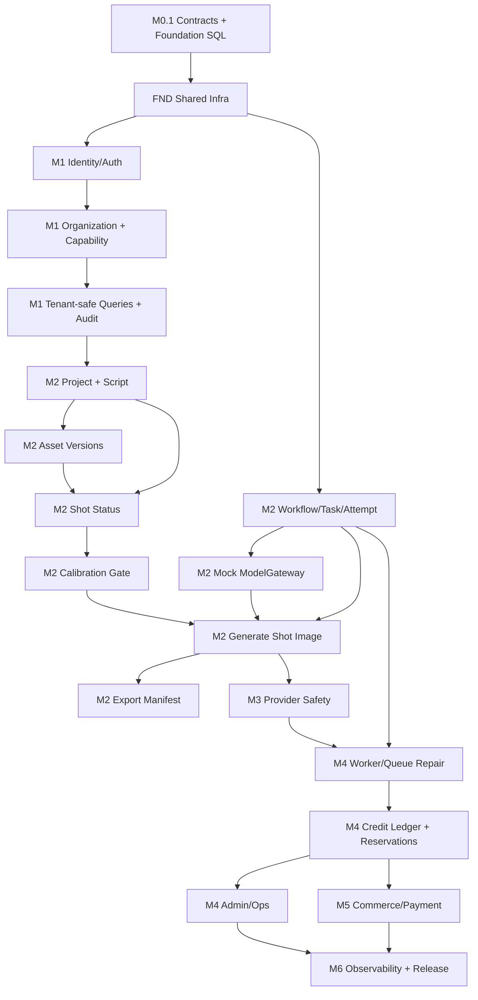

# P0 Delivery Execution System

> Status: M0.1 follow-up / Delivery execution baseline  
> Date: 2026-05-08  
> Purpose: convert the module implementation blueprint into a daily/weekly development execution system that delivers capabilities, exposes risk early, and gates releases through tests and observable milestones.

## 1. Rule

Do not manage P0 by file lists or module names. Manage it by delivered capabilities.

Every task must answer:

```text
What capability is delivered?
What does it depend on?
What data does it read/write?
Which command/event contract does it use?
How is it tested?
How is it observed?
What proves it is done?
```

## 2. Minimum Runnable Loop

The first delivery target is not the full PRD. It is the smallest true P0-A loop that validates architecture, data, permissions, workflow execution, task state, and frontend/backend integration.

### 2.1 M2 Thin Vertical Slice

```text
Email-code login
  -> resolve organization/workspace actor context
  -> create project with script text
  -> create script parse workflow using mock provider
  -> persist workflow/task/attempt/provider request state
  -> show durable task status after refresh
  -> create parsed episodes/assets/shots from mock output
  -> confirm key assets
  -> split shots / mark shots ready
  -> create calibration session
  -> pass or skip calibration with audit
  -> generate one shot image through mock ModelGateway
  -> create immutable asset version and current pointer
  -> export an asset package manifest
```

### 2.2 What Makes It Real

The loop is accepted only if it has:

- Real API handlers, not local fake frontend state.
- Real PostgreSQL-backed persistence or migration-backed repository tests.
- Real authentication/session guard.
- Real organization/workspace/member capability checks.
- Real idempotency on project/script/generation/export commands.
- Real workflow/task/attempt state transitions.
- Real mock provider adapter behind the ModelGateway interface.
- Real immutable asset version rows or repository behavior.
- Real export manifest creation.
- Real structured logs carrying `traceId`, `organizationId`, `projectId`, `workflowId`, and `taskId` where applicable.
- Real API/integration/E2E tests in the gates named by `p0-verification-plan.md`.

The loop is rejected if:

- Project status is only frontend state.
- Task status is only Redis/BullMQ state.
- Permission is only hidden UI.
- Generated output is overwritten instead of versioned.
- Refresh creates duplicate expensive tasks.
- Export ignores missing assets.

## 3. Capability Breakdown

### 3.1 Foundation Capabilities

| Capability ID | Capability | Owner Module | Value | Risk |
| --- | --- | --- | --- | --- |
| FND-01 | Apply foundation migrations and schema constraints | DB/Infra | Creates durable truth surface. | High |
| FND-02 | Shared contract consumption in backend modules | Contracts | Prevents command/event drift. | High |
| FND-03 | Operation-scoped idempotency helper with persistence | Shared/Idempotency | Prevents duplicate side effects. | High |
| FND-04 | Outbox/inbox event infrastructure | Shared/Infra | Prevents PostgreSQL/queue drift. | High |
| FND-05 | Structured error code and response shape | API/Shared | Makes frontend/test behavior stable. | Medium |
| FND-06 | Trace/log context propagation | Shared/Ops | Makes failures diagnosable. | High |

### 3.2 M1 Platform Foundation Capabilities

| Capability ID | Capability | Owner Module | Value | Risk |
| --- | --- | --- | --- | --- |
| M1-01 | Email-code issue/verify login | Identity/Auth | Allows real user sessions. | High |
| M1-02 | Server-side session guard | Identity/Auth | Prevents unauthenticated access. | High |
| M1-03 | Organization/workspace/membership model | Organization | Establishes tenant scope. | High |
| M1-04 | Capability resolver and `assertCapability` | Organization | Enforces module command access. | High |
| M1-05 | Tenant-safe repository/query helper | Shared/DB | Reduces data leak risk. | High |
| M1-06 | Audit append helper | Audit | Gives traceable sensitive operations. | Medium |

### 3.3 M2 Creator Loop Capabilities

| Capability ID | Capability | Owner Module | Value | Risk |
| --- | --- | --- | --- | --- |
| M2-01 | Create project and script | Project | Starts creator workflow. | High |
| M2-02 | Parse script workflow with mock provider | Project, Workflow/Task, ModelGateway | Proves durable long task start. | High |
| M2-03 | Workflow/task/attempt claim and finalization skeleton | Workflow/Task | Spine for long-running work. | High |
| M2-04 | Asset and immutable asset version creation | Asset | Protects regeneration history. | High |
| M2-05 | Shot creation/status/current pointer rules | Shot | Proves storyboard state model. | High |
| M2-06 | Calibration session pass/skip gate | Quality/Review, Shot | Prevents invalid batch generation. | Medium |
| M2-07 | Generate single/batch shot image with mock provider | Shot, Workflow/Task, ModelGateway, Asset | Validates core AI output flow. | High |
| M2-08 | Export package manifest | Export, Asset | Closes first demonstrable loop. | Medium |
| M2-09 | Web/API E2E happy path | Web, API | Proves front/back integration. | High |

### 3.4 M3-M6 Hardening Capabilities

| Capability ID | Capability | Owner Module | Value | Risk |
| --- | --- | --- | --- | --- |
| M3-01 | ProviderRequest pre-call persistence | ModelGateway | Prevents blind duplicate provider calls. | High |
| M3-02 | Provider accepted-timeout to `result_unknown` | ModelGateway, Workflow/Task | Handles ambiguous external side effects. | High |
| M4-01 | Redis queued task repair | Workflow/Task | Recovers lost dispatch. | High |
| M4-02 | Worker lease repair | Workflow/Task | Recovers worker crash. | High |
| M4-03 | Credit ledger baseline | Credit/Billing | Establishes accounting truth. | High |
| M4-04 | Reservation allocation and single settlement | Credit/Billing | Prevents oversell/double charge. | High |
| M4-05 | Admin/Ops retry/manual settlement | Admin/Ops | Closes unresolved states. | High |
| M5-01 | Credit package/order/payment intent | Commerce/Payment | Enables paid beta. | High |
| M5-02 | Payment callback verification and dedup | Commerce/Payment | Prevents financial corruption. | High |
| M5-03 | `payment.succeeded` to credit grant | Commerce/Payment, Credit/Billing | Separates cash from credit truth. | High |
| M5-04 | Refund/invoice/reconciliation gates | Commerce/Payment, Admin/Ops | Controls compliance risk. | High |
| M6-01 | Dashboards, alerts, runbooks | Ops | Makes beta operable. | High |
| M6-02 | Release, rollback, and staging dry-run | Infra/Ops | Makes release controlled. | High |

## 4. Dependency Graph



Critical path:

```text
M0.1 -> M1 Auth/Org/Tenant -> M2 Project/Workflow/Mock Provider/Shot/Image/Export -> M3 Provider Safety -> M4 Reliability/Credit/Ops -> M5 Payment -> M6 Beta
```

## 5. Development Batches

| Batch | Goal | Entry Criteria | Exit Criteria |
| --- | --- | --- | --- |
| B0 M0.1 Ready | Contracts and foundation gates are executable. | Architecture blueprint exists. | Contract tests pass; M0.1 exit recorded. |
| B1 M1 Foundation | Real tenant-safe access. | B0. | Login/session, actor context, capability, tenant leak, audit tests pass. |
| B2 M2 Skeleton Loop | Project/script/workflow/task/mock provider runs with durable status. | B1. | Create project -> parse workflow -> status query survives refresh. |
| B3 M2 Creator Closure | Asset/shot/calibration/generate/export close the P0-A loop. | B2. | P0-A E2E happy path with mock provider passes. |
| B4 M3 Provider Safety | Real provider dogfood is safe. | B3. | No-blind-retry tests pass after external submission start. |
| B5 M4 Reliability | System can recover from common failures. | B4. | Redis loss, worker crash, outbox replay, unknown/manual review gates pass. |
| B6 M4 Credit/Ops | Credits and operations become reliable. | B5. | Reservation/no-oversell/single-settlement/Admin audit tests pass. |
| B7 M5 Commerce Gate | Paid credit purchase is beta-safe. | B6 plus provider/finance checks. | Duplicate callback one grant; paid-without-credit repair; refund/invoice gates pass. |
| B8 M6 Release Readiness | Operable commercial beta. | B7. | Dashboards/runbooks/staging dry-run/rollback acceptance pass. |

## 6. Task Card Template

Use this exact card format in GitHub issues, Linear, or the local task board.

```text
Task Name:
Epic:
Feature / Capability ID:
Delivery Batch:
Business Value: High / Medium / Low
Technical Risk: High / Medium / Low
Owner Role:
Reviewer Roles:
Prerequisites:
Inputs:
Outputs:
Data Read:
Data Written:
Command Contract:
Event Contract:
State Preconditions:
Failure / Exception Scenarios:
Idempotency / Dedup:
Security / Tenant Scope:
Observability:
Tests:
Acceptance Criteria:
Definition of Done:
Blocked By:
Blocks:
```

## 7. Initial Task Cards

### B1-T01 Email-Code Login

| Field | Content |
| --- | --- |
| Epic | Platform Foundation |
| Capability | M1-01 Email-code issue/verify login |
| Batch | B1 |
| Value / Risk | High / High |
| Prerequisites | `users`, `login_codes`, `auth_sessions` migration decisions; error response shape |
| Inputs | Email, login purpose, verification code |
| Outputs | Server-controlled session |
| Data Written | `login_codes`, `auth_sessions`, `users.last_login_at` |
| Command Contract | Auth command class from M0 freeze; no public API command yet in contracts package |
| Failure Scenarios | Expired code, consumed code, wrong code, disabled user, rate limit |
| Idempotency | Issue throttle by email/IP; verify consumes code once with row lock |
| Security | Hash code and session tokens; never log plaintext code |
| Observability | `traceId`, email hash, issue/verify result, rate-limit bucket |
| Tests | Unit: code hashing/consume; API: issue/verify/expired/wrong; Security: no plaintext storage |
| Acceptance Criteria | User can obtain and verify email code; repeated verification cannot create multiple sessions from one code; disabled user denied |
| DoD | Code, migration, tests, docs, error codes, logs, audit event if applicable |

### B1-T02 Actor Context and Capability Resolver

| Field | Content |
| --- | --- |
| Epic | Platform Foundation |
| Capability | M1-03, M1-04 |
| Batch | B1 |
| Value / Risk | High / High |
| Prerequisites | Login/session guard |
| Inputs | Session token, organization/workspace scope |
| Outputs | `ActorContext` with user/org/workspace/membership/capabilities |
| Data Read | `users`, `organizations`, `workspaces`, `memberships` |
| Data Written | None |
| Command Contract | Capability names from `packages/contracts/domain/capabilities.ts` |
| Failure Scenarios | No session, disabled user, suspended org, missing membership, insufficient capability |
| Idempotency | Read-only |
| Security | Backend checks only; UI hiding does not count |
| Observability | `traceId`, `userId`, `organizationId`, denial reason |
| Tests | API integration: 401, 403, disabled user/org/member; tenant leak negative tests |
| Acceptance Criteria | Every protected command can call `assertCapability`; unauthorized access never reaches domain write |
| DoD | Resolver, guard, test fixtures, tests, logs |

### B2-T01 Project Create With Script

| Field | Content |
| --- | --- |
| Epic | Creator Loop |
| Capability | M2-01 |
| Batch | B2 |
| Value / Risk | High / High |
| Prerequisites | B1-T02, idempotency helper, project/script migrations |
| Inputs | Workspace, project name, script text/file reference, aspect ratio, resolution |
| Outputs | `project_id`, initial `script_id`, `project_phase = script_input` |
| Data Written | `projects`, `scripts`, `audit_events`, `idempotency_records` |
| Command Contract | `CreateProject` |
| Failure Scenarios | Invalid input, duplicate idempotency key conflict, missing workspace, no capability |
| Idempotency | `(organization_id, project.create, idempotency_key)` + request hash |
| Security | `project:create`, tenant-scoped workspace |
| Observability | `traceId`, `projectId`, `workspaceId`, actor |
| Tests | API integration: success, invalid input, replay, conflict, forbidden |
| Acceptance Criteria | Real DB project/script created once; replay returns same project; conflict returns stable 409 |
| DoD | API, repository, tests, docs, logs |

### B2-T02 Script Parse Workflow With Mock Provider

| Field | Content |
| --- | --- |
| Epic | Creator Loop |
| Capability | M2-02, M2-03 |
| Batch | B2 |
| Value / Risk | High / High |
| Prerequisites | B2-T01, workflow/task migrations, outbox dispatcher shape |
| Inputs | Project/script ID |
| Outputs | `workflow_id`, task status, parsed mock episodes/assets/shots |
| Data Written | `workflows`, `tasks`, `task_attempts`, `provider_requests` if provider boundary used, `episodes`, candidate `assets`, `shots` |
| Command Contract | `ParseScript` |
| Event Contract | `workflow.completed`, `task.succeeded` |
| Failure Scenarios | Duplicate parse, parse failed, worker crash before finalization |
| Idempotency | `script.parse` idempotency record; duplicate running command returns same workflow |
| Security | `project:edit` |
| Observability | `workflowId`, `taskId`, `attemptId`, parse stage |
| Tests | API idempotency, worker integration success/failure, refresh-running status |
| Acceptance Criteria | Status query shows queued/running/succeeded/failed from PostgreSQL; refresh creates no duplicate workflow |
| DoD | Command, worker skeleton, mock provider, tests, logs |

### B3-T01 Asset Version and Shot Pointer Safety

| Field | Content |
| --- | --- |
| Epic | Creator Loop |
| Capability | M2-04, M2-05 |
| Batch | B3 |
| Value / Risk | High / High |
| Prerequisites | B2-T02 |
| Inputs | Shot generation result, content revision, active task ID |
| Outputs | Immutable asset version; current pointer only if active intent matches |
| Data Written | `assets`, `asset_versions`, `shots.current_image_asset_version_id` |
| Command Contract | `GenerateShotImage` downstream finalization |
| Event Contract | `asset.version.created`, `task.succeeded` |
| Failure Scenarios | Late stale task success, out-of-order regeneration, failed output validation |
| Idempotency | Active task/content revision guard; version number unique per asset |
| Security | Signed URL checks later in storage module |
| Observability | `assetVersionId`, `shotId`, `activeTaskId`, stale completion marker |
| Tests | Domain/worker: stale task completion, out-of-order regeneration, version not overwritten |
| Acceptance Criteria | Regeneration never overwrites previous asset; stale completion cannot move current pointer |
| DoD | Domain logic, finalization tests, repository constraints, logs |

### B3-T02 Calibration Gate

| Field | Content |
| --- | --- |
| Epic | Creator Loop |
| Capability | M2-06 |
| Batch | B3 |
| Value / Risk | Medium / Medium |
| Prerequisites | Shots ready |
| Inputs | Three representative shot IDs; pass/skip decision |
| Outputs | Durable calibration session and decision |
| Data Written | `calibration_sessions`, `calibration_items`, `calibration_decisions`, `audit_events` |
| Command Contract | `GenerateCalibration`, `PassCalibration`, `SkipCalibration` |
| Event Contract | `calibration.passed` |
| Failure Scenarios | Less/more than three shots, failed quality review, unauthorized skip |
| Idempotency | `calibration.generate/pass/skip` operation names |
| Security | `project:edit`; skip requires authorized actor |
| Observability | `calibrationSessionId`, decision, actor |
| Tests | API: gate rejects batch generation before pass/skip/override; quality failure blocks pass |
| Acceptance Criteria | Backend, not UI, blocks batch image generation until durable gate exists |
| DoD | API, domain state, tests, audit/logs |

### B3-T03 Generate Shot Image With Mock Provider

| Field | Content |
| --- | --- |
| Epic | Creator Loop |
| Capability | M2-07 |
| Batch | B3 |
| Value / Risk | High / High |
| Prerequisites | B3-T01, B3-T02, workflow/task skeleton |
| Inputs | Shot ID, prompt/reference context |
| Outputs | Task ID, generated mock output asset version, shot image status |
| Data Written | `workflows`, `tasks`, `task_attempts`, `provider_requests`, `asset_versions`, `shots` |
| Command Contract | `GenerateShotImage` |
| Event Contract | `task.succeeded`, `asset.version.created` |
| Failure Scenarios | Calibration missing, insufficient credits, provider failure, duplicate running generation |
| Idempotency | `shot.image.generate` idempotency + active task guard |
| Security | `generation:start` |
| Observability | `workflowId`, `taskId`, `providerRequestId`, `shotId` |
| Tests | TC-P0-004, TC-P0-012, R-002, R-016 |
| Acceptance Criteria | Batch partial success supported; duplicate running generation returns existing task |
| DoD | Command, worker, mock adapter, finalization, tests, logs |

### B3-T04 Export Package Manifest

| Field | Content |
| --- | --- |
| Epic | Creator Loop |
| Capability | M2-08 |
| Batch | B3 |
| Value / Risk | Medium / Medium |
| Prerequisites | At least one completed image asset |
| Inputs | Project ID, incomplete export confirmation flag |
| Outputs | Export record, manifest, download-ready state for mock/local storage |
| Data Written | `exports`, export manifest storage/object metadata, `audit_events` |
| Command Contract | `CreateExport` |
| Event Contract | `export.ready` later |
| Failure Scenarios | Missing assets, no exportable shots, duplicate export request |
| Idempotency | `export.create` operation name |
| Security | `export:create` |
| Observability | `exportId`, missing asset count, manifest size |
| Tests | TC-P0-007, TC-P0-014, R-017 |
| Acceptance Criteria | Missing assets are explicit; export does not silently fail |
| DoD | API, manifest generation, tests, logs |

### B4-T01 Provider Side-Effect Protection

| Field | Content |
| --- | --- |
| Epic | Provider Safety |
| Capability | M3-01, M3-02 |
| Batch | B4 |
| Value / Risk | High / High |
| Prerequisites | M2 mock provider loop |
| Inputs | Provider payload, task/attempt context |
| Outputs | Provider request persisted before external call; `result_unknown` when ambiguous |
| Data Written | `provider_requests`, task/attempt status |
| Command Contract | Internal ModelGateway provider submit |
| Event Contract | Provider result event later |
| Failure Scenarios | Crash before external start, crash after external start, timeout before accept, timeout after accept |
| Idempotency | `client_request_id`; no blind retry after `external_submission_started_at` |
| Security | Provider secrets server-only; redacted payload storage |
| Observability | `providerRequestId`, provider, capability, retry safety |
| Tests | A-001, R-026, R-027 |
| Acceptance Criteria | After external submission starts, recovery never creates a second provider request automatically |
| DoD | Adapter interface, persisted policy snapshot, tests, logs/runbook note |

## 8. Batch-Level Definition of Done

Every task:

- Code compiles or the contract test file runs.
- Happy path test exists.
- At least one meaningful failure/permission/idempotency test exists for core behavior.
- Command/event contract touched is referenced.
- Data owner and writing table are named.
- Error codes are stable enough for frontend/tests.
- Logs include the IDs needed to diagnose failures.
- Documentation is updated if state, ownership, contract, or workflow changes.
- PR references at least one verification ID.

Every batch:

- Entry criteria were true before work began.
- Exit criteria are executable and have been run.
- No task is marked done if it cannot be tested or observed.
- Open risks are either burned down or explicitly moved to the next gate with an owner.
- Demo path is documented.

## 9. Testing and Acceptance Matrix

| Batch | Required Tests |
| --- | --- |
| B1 | Auth API tests, disabled user/org/member tests, tenant leak tests, audit helper tests. |
| B2 | Project create idempotency, script parse idempotency, workflow/task status tests, refresh-running status tests. |
| B3 | Calibration gate, shot image generation, partial success, stale pointer, export missing assets, P0-A E2E. |
| B4 | Provider crash/timeout matrix, no blind retry after external start, provider payload privacy check. |
| B5 | Redis loss repair, worker double claim, lease repair, outbox replay, manual review aggregation. |
| B6 | Ledger recomputation, reservation no-oversell, allocation single settlement, Admin/Ops audit. |
| B7 | Callback signature, duplicate callback, amount mismatch, frontend return no grant, paid-without-credit repair, refund/invoice gates. |
| B8 | Observability drill, staging dry-run, rollback drill, security smoke, performance smoke. |

## 10. Non-Functional Work Items

These are first-class tasks, not cleanup.

| Area | Required Work | Gate |
| --- | --- | --- |
| Error handling | Shared error code registry and API error shape. | B1/B2 |
| Logging | Trace context middleware and module log fields. | B1/B2 |
| Metrics | API latency, worker duration, task status counts, provider status counts. | B4/B5 |
| Audit | Sensitive command audit with actor/scope/reason/target. | B1/B6 |
| Config | Environment validation and provider/storage/queue config separation. | B1/B4 |
| Migrations | Migration runbook, rollback posture, owner comments. | B1/B2 |
| CI/CD | `contracts`, `unit`, `integration`, `e2e-p0-a` jobs. | B1-B3 |
| Release | Staging deployment, smoke test, rollback steps. | B8 |
| Security | Tenant leak tests, signed URL auth, provider secret redaction. | B1/B3/B4 |
| Runbooks | Stuck task, unknown provider result, paid without credit, callback mismatch. | B5/B7 |

## 11. Risk Front-Loading

| Risk | Trigger | Front-Loaded Task | Escalation |
| --- | --- | --- | --- |
| Tenant leak | Any query without explicit organization scope. | Tenant-safe query helper before Project module. | Block PR. |
| Duplicate expensive work | Any command starts workflow/task/provider call. | Idempotency helper before creator commands. | Block PR. |
| Provider double charge/output | Any real provider call. | ProviderRequest pre-call persistence and no-blind-retry test. | No real provider dogfood. |
| Asset overwrite | Any regeneration updates current pointer. | Immutable asset versions and active task guard. | Block M2 exit. |
| BullMQ/Postgres drift | Any queued/running task depends only on Redis. | Outbox/queued task repair. | Block M4 exit. |
| Credit oversell | Any concurrent generation consumes credit. | Reservation allocation concurrency test. | Block M4 exit. |
| Payment double grant | Any callback processing creates credit. | Callback dedup + ledger source uniqueness. | Block M5 exit. |
| Ops invisibility | Any unresolved state lacks admin view/logs. | Admin/Ops diagnosis and runbooks. | Block M6 exit. |

## 12. Board Model and Cadence

### 12.1 Board States

```text
Backlog
Ready for Refinement
Ready for Development
In Development
Self-Test
Integration
QA / Acceptance
Blocked
Done
```

Exit from `Ready for Development` requires:

- Task card complete.
- Dependencies named.
- Verification IDs named.
- Test type known.
- Data owner/reviewer known.

Exit to `Done` requires:

- Acceptance criteria verified.
- Tests run and linked.
- Observability/log fields present if required.
- Docs updated for any contract/state/data change.

### 12.2 Daily Operating Questions

Ask daily:

1. Which task advanced the minimum runnable loop?
2. Which task is blocked by an undefined contract or missing migration?
3. Which task is done in code but not verifiable?
4. Which risk moved closer to the critical path?
5. Which test or runbook failed to exist when needed?

### 12.3 Weekly Milestone Review

Review weekly:

- Demo the current loop, even if thin.
- Re-run the milestone gate commands.
- Review blocked tasks by dependency owner.
- Burn down high-value/high-risk items before low-risk polish.
- Decide whether any assumption was invalidated and needs a contract-change record.

## 13. Priority Rule

Sort work by:

```text
1. High value + high risk
2. High value + medium/low risk
3. Medium value + high risk
4. Low value + low risk
```

Do not start broad UI/product breadth until the thin loop proves:

- real auth
- real tenant scope
- real persistence
- real workflow state
- real idempotency
- real mock provider execution
- real output versioning
- real export
- real tests

## 14. Immediate Next Actions

1. Convert B1 task cards into implementation issues or a plan file.
2. Start with B1-T01 and B1-T02; do not start Project module before actor context and tenant-safe query tests exist.
3. Add missing contract entries for auth/admin/storage as soon as their command shapes are implemented.
4. Keep P0-A focused on the thin creator loop; defer commercial payment until B7 gates are legitimately reachable.
